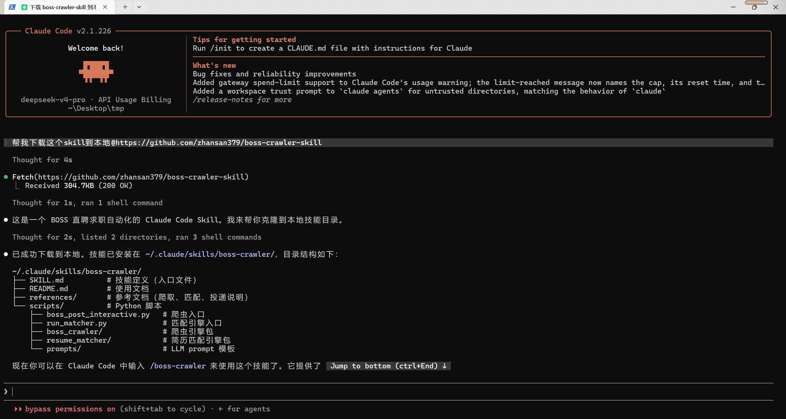
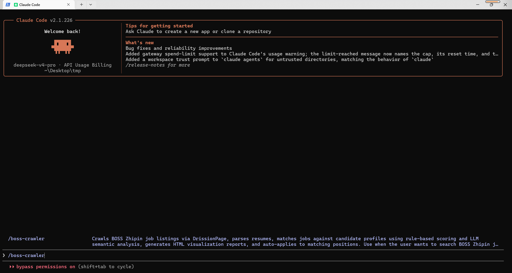
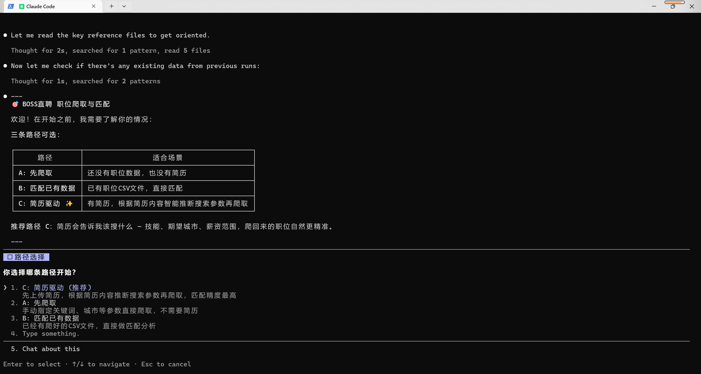
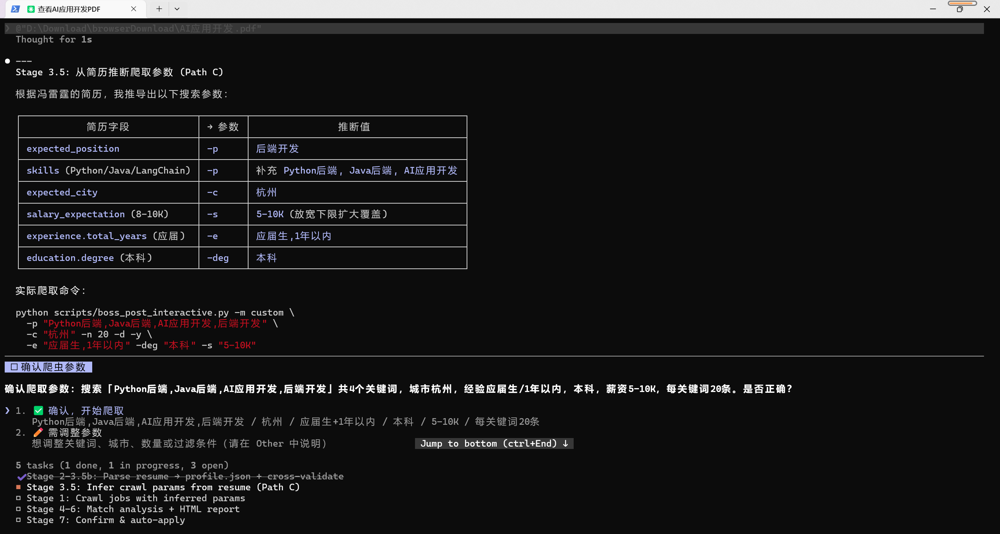
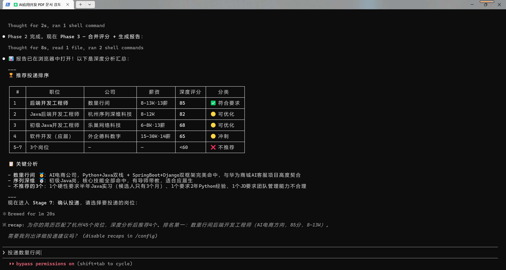
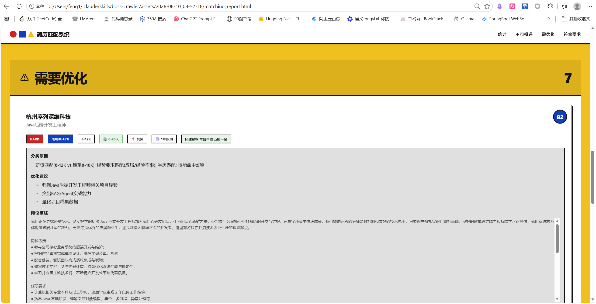
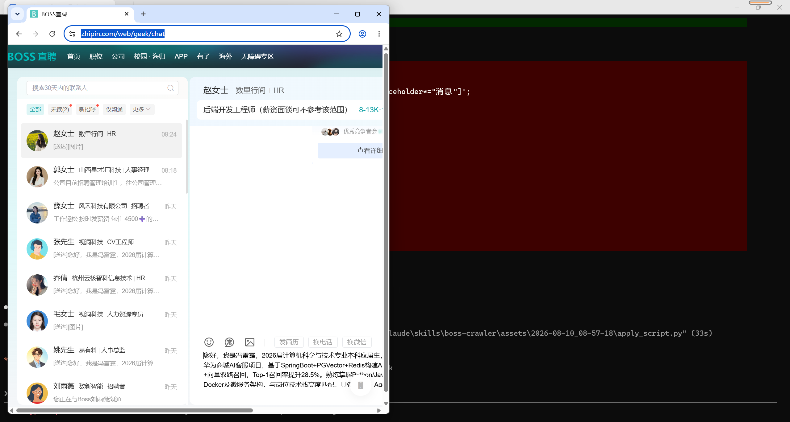

# 🤖 BOSS 直聘岗位爬取与智能投递助手

[](https://www.python.org/)
[](LICENSE)
[](https://claude.ai/code)

> 🚀 **这是一个 Claude Code Skill** — 在 Claude Code 中输入 `/boss-crawler` 即可启动完整的求职自动化流程。

一套完整的 BOSS 直聘求职自动化工具：**爬取岗位 → 解析简历 → 智能匹配 → 可视化报告 → 自动投递**。所有 LLM 分析由 Claude Code 自身模型能力完成，帮助你更好**精投简历**。

## ⚠️ 免责声明
本项目仅供学习和技术研究参考，旨在探讨 Chrome DevTools Protocol、前端反爬机制与数据采集技术。请勿用于任何违反 BOSS直聘用户协议 或相关法律法规的用途，不得用于商业转售、恶意爬取或对目标网站造成负担的行为。使用本项目所产生的一切后果由使用者自行承担，作者不对任何滥用行为负责。

## 搜集的投递技巧
[在boss直聘如何打招呼语](Tutorial/Greeting.md)

## 🆚 与浏览器插件的区别

市面上的 BOSS 直聘自动化工具多为**浏览器扩展（油猴脚本 / Chrome 插件）**，本 Skill 则是一个**完整的桌面端自动化系统**。以下是核心差异：

### 1. 架构深度

| | 浏览器插件 | 本 Skill |
|---|---|---|
| **运行环境** | 浏览器扩展沙箱，能力受限 | Python + Chrome CDP 协议，完整系统权限 |
| **核心驱动** | JS 注入网页 DOM 操作 | DrissionPage（CDP 协议级控制浏览器） |
| **反检测能力** | 弱 — 代码注入页面，易被检测 | 强 — CDP 层操作，网站看不到注入代码 |
| **登录持久化** | 依赖浏览器 cookie | 独立 `chrome_user_data/` 目录，cookie 隔离持久化 |

### 2. 智能化程度

- **插件**：大多数只有"自动点击发送"或"批量沟通"，**没有简历解析和岗位匹配能力**，对所有岗位一视同仁地海投。
- **本 Skill**：
  - **简历深度解析** — Claude 语义理解，提取技能栈、项目经验、量化指标
  - **6 维度评分** — 薪资/经验/学历/技能重合/职位相关/AI 优势（满分 115）
  - **4 层岗位分类** — Tier 1 高匹配 → Tier 4 自动丢弃
  - **路径 C** — 上传简历后自动推断搜索参数，无需手动填关键词

### 3. 海投 vs 精准投递

| 策略 | 浏览器插件 | 本 Skill |
|---|---|---|
| **投递模式** | 批量点击、统一招呼语 | 先匹配 → 只投高匹配岗位 |
| **招呼语** | 固定模板 | 逐个岗位个性化生成（结合简历亮点 + JD 关键词） |
| **频率控制** | 通常无节制，易被风控 | 每次间隔 3-5 秒，模拟正常人工操作 |


### 总结

**插件是"省力工具"**，帮你点得快；**本 Skill 是"求职参谋"**，帮你选得准、投得精。

---

## 📦 安装

### 方式一：让 Claude Code 自动安装（推荐）

在 Claude Code 中输入：

```
请帮我安装这个 skill：https://github.com/zhansan379/boss-crawler-skill.git

```

Claude 会自动克隆仓库、安装依赖、注册 skill。完成后输入 `/boss-crawler` 即可使用。




### 方式二：手动安装

```bash
# 1. 克隆仓库
mkdir -p ~/.claude/skills/boss-crawler
cd ~/.claude/skills/boss-crawler
git clone https://github.com/yourusername/boss-crawler-skills.git
```

然后用 Claude Code 打开项目目录，输入 `/boss-crawler` 即可。


---

## 🗺️ 使用方式

### 方式一：Claude Code Skill（推荐）


#### 完整流程体验

以下以**路径 C（简历驱动爬取）**为例，展示从零到投递的完整对话流程。

##### 阶段 1：启动与状态检测
安装skill后，重启命令行窗口
```
用户: /boss-crawler

Claude: 你好！我是 BOSS 直聘求职助手。看起来你还没有岗位数据。
        请先上传你的简历（PDF/Word/文本），我会帮你精准匹配。
```




Skill 启动后，Claude 首先检测当前数据状态——有没有简历、有没有已爬取的岗位 CSV。根据检测结果自动选择路径（A/B/C），并引导用户进入下一步。

| 路径 | 触发条件 | 流程 |
|------|---------|------|
| **路径 C** ✨ 简历驱动爬取 | 你有简历、还没爬过岗位 | 上传简历 → Claude 自动推断搜索参数 → 精准爬取 → 匹配 → 投递 |
| **路径 B** 匹配现有数据 | 已有岗位 CSV 数据 | 上传简历 → 加载已有岗位 → 匹配 → 投递 |
| **路径 A** 先爬后匹配 | 首次使用、无任何数据 | 手动指定搜索条件 → 爬取 → 上传简历 → 匹配 → 投递 |

**路径 C 是最智能的方式**：简历里已经包含了你的技能方向、工作经验和期望城市，让简历告诉系统该搜什么，而不是盲猜。爬出来的岗位天然与背景对口，匹配命中率更高。



##### 阶段 2：上传简历 & 智能推断搜索参数

```
用户: [上传简历文件]

Claude: 📋 根据你的简历推断：
        - 搜索关键词：Python, 后端开发, AI应用开发, RAG
        - 目标城市：杭州
        - 经验筛选：应届生, 1年以内
        - 薪资筛选：5-10K, 10-20K
        是否按以上参数开始爬取？
```


Claude 深度解析简历内容，提取技能栈、工作年限、期望城市等关键信息，自动映射为 BOSS 直聘的搜索筛选条件。用户只需确认或微调，无需手动填写任何参数。这就是路径 C 的核心优势——**让简历告诉系统该搜什么**。


##### 阶段 3：确认 & 执行爬虫

```
用户: 确认

Claude: [执行爬虫 → 获取 80 个岗位 → 6 维度评分]
```

用户确认搜索参数后，Claude 启动 DrissionPage 浏览器自动化，在 BOSS 直聘执行关键词搜索、筛选条件设置、翻页爬取。爬虫自动去重（基于 `link` 字段），并将岗位详情（职位名、薪资、公司、JD 描述等）写入 `post_data/*.csv`。以关键词 "Python" + 城市 "杭州" 为例，通常可获取 50-150 个有效岗位。




##### 阶段 4：智能匹配 & 评分排名

```
Claude: 📊 分析完成！
        Tier 1 (≥100 高匹配):   12 个
        Tier 2 (≥85 中等):      23 个
        Tier 3 (≥70 低匹配):    30 个
        
        📋 推荐投递 Top 12：
        | # | 公司 | 职位 | 薪资 | 匹配度 | 难度 |
        |---|------|------|------|--------|------|
        | 1 | XX科技 | Python后端 | 15-25K | 108 | 易 |
        | 2 | YY公司 | AI应用开发 | 12-20K | 102 | 易 |
        ...
        是否确认投递？
```

先由 Python 规则引擎对全部岗位做快速初筛（薪资、经验、学历、技能词边界匹配 + 别名归一化），再对候选岗位执行 Claude 语义深度分析（JD 职责与简历项目的实质匹配、技术栈契合度）。6 维度评分（薪资/经验/学历/技能/职位相关/AI 优势，满分 115）后按 4 层分类归档：Tier 1（≥100）高匹配直接投递，Tier 2（≥85）中等匹配优化后投递，Tier 3（≥70）低匹配不推荐，Tier 4 自动丢弃。同时生成 Bauhaus 风格 HTML 可视化报告，包含所有岗位的匹配度卡片、分类统计图表和投递状态。





##### 阶段 5：确认 & 自动投递

```
用户: 投递前 5 个

Claude: [逐个生成个性化招呼语 → 用户确认 → 浏览器自动投递]
        ✅ 投递完成！5/5 成功
        📄 报告已生成: assets/2026-08-10_14-30-00/matching_report.html
```

用户从 Tier 1 榜单中选择要投递的岗位（可指定数量或具体岗位），Claude 为每个岗位生成个性化招呼语——结合简历亮点与 JD 关键词，突出匹配优势。用户确认招呼语后，DrissionPage 自动打开浏览器、进入岗位详情页、发送招呼、上传简历附件。每次投递间隔 3-5 秒以规避反爬，投递结果记录到 `apply_log.json`。




---

### 方式二：独立命令行工具

Skill 中的每个阶段也可以作为独立 Python 脚本运行，不依赖 Claude Code：

```bash
# 爬取岗位
python scripts/boss_post_interactive.py -m custom -p "Python" -c "北京" -n 20 -d -y

# 快速匹配（纯规则，零 token 消耗）
python scripts/run_matcher.py --mode quick --profile assets/<ts>/profile.json

# 深度匹配（规则预筛选 + LLM 语义分析）
python scripts/run_matcher.py --mode deep --profile assets/<ts>/profile.json --top 15
```

---

## ✨ 核心能力

| 模块 | 功能 | 亮点 |
|------|------|------|
| 🔍 **岗位爬虫** | BOSS 直聘数据采集 | 关键词搜索、多城市并发、高级筛选、详情页采集 |
| 📄 **简历解析** | PDF/Word/文本 → 结构化 JSON | Claude 深度理解，保留量化指标和项目要点 |
| 🎯 **智能匹配** | 双模式评分 | 快速模式（纯规则秒级）+ 深度模式（LLM 语义分析） |
| 📊 **可视化报告** | HTML 交互报告 | 双主题、岗位卡片含匹配度/难度/成功概率 |
| 🚀 **自动投递** | DrissionPage 浏览器自动化 | 个性化招呼语 + 简历附件上传 + 投递日志 |

### 🎯 6 维度评分体系（0-115 分）

| 维度 | 分值 | 说明 |
|------|------|------|
| 💰 薪资匹配 | 0-20 | JD 薪资区间与期望区间的重叠度 |
| 📅 经验匹配 | 0-20 | JD 年限要求 vs 实际工作年限 |
| 🎓 学历匹配 | 0-15 | 学历要求匹配 |
| 🔧 技能重合 | 0-30 | 词边界匹配 + 40+ 技能别名归一化 |
| 🏷️ 职位相关 | 0-20 | 岗位名与目标关键词的相关度 |
| 🤖 AI 优势 | 0-10 | RAG/Agent/LLM 等 AI 关键词梯度加分 |

### 📊 4 层岗位分类

```
Tier 1 (≥100 分) → 高匹配，可直接投递   ✅
Tier 2 (≥85 分)  → 中等匹配，优化后投递  ⚡
Tier 3 (≥70 分)  → 低匹配，不推荐       ❌
Tier 4 (<70 分)  → 不匹配，自动丢弃     ⛔
```

---

## 🏗️ 架构

```
SKILL.md (Claude Code Skill 定义 — 编排完整流程)
    │
    ├─ 阶段 1: scripts/boss_crawler/  ──→  post_data/*.csv
    ├─ 阶段 2-3: Claude 自身  ──→  assets/<ts>/profile.json
    ├─ 阶段 4-5: scripts/resume_matcher/ ──→  规则评分 + LLM 语义分析
    ├─ 阶段 6: scripts/resume_matcher/report.py ──→  assets/<ts>/matching_report.html
    └─ 阶段 7: scripts/resume_matcher/auto_apply.py ──→  浏览器自动投递
```

```
boss-crawler/                         # Skill 根目录 (~/.claude/skills/boss-crawler/)
├── SKILL.md                          # 🔑 Skill 定义（编排完整流程）
├── README.md                         # 使用文档
│
├── assets/                           # 📦 运行输出（无需加载到上下文的最终产物）
│   ├── LATEST.txt                    # 最近运行指针
│   └── <timestamp>/                  # 每次运行隔离到时间戳子目录
│       ├── profile.json              # 简历结构化解析
│       ├── matching_report.html      # HTML 可视化报告
│       ├── job_classification.json   # 岗位分类结果
│       ├── deep_candidates.json      # 深度模式候选
│       ├── deep_results.json         # Claude 深度分析结果
│       ├── apply_log.json            # 投递记录
│       └── resume_{公司}_{职位}.md    # 定制优化简历
│
├── references/                       # 📚 参考文档（按需加载）
│   ├── crawl-commands.md             # 爬取命令与参数
│   ├── resume-parsing.md             # 简历解析与交叉校验
│   ├── matching.md                   # 双模式匹配与评分
│   ├── auto-apply.md                 # 招呼语与自动投递
│   └── scripts.md                    # 包/函数参考
│
└── scripts/                          # 🐍 可执行脚本（自包含）
    ├── boss_post_interactive.py      # 爬虫 CLI 入口
    ├── run_matcher.py                # 匹配系统 CLI 入口
    ├── validate_profile.py           # Profile 交叉校验
    ├── boss_crawler/                 # 爬虫引擎包 (8 modules)
    │   ├── config.py                 # 常量、筛选映射表、Chrome 配置
    │   ├── crawler.py                # 翻页爬取、详情采集、流程编排
    │   ├── auth.py                   # 登录检测（单次检测、无轮询）
    │   ├── data_loader.py            # JSON 加载、CSV 去重、在线更新
    │   ├── cli.py                    # 命令行参数解析
    │   ├── menu.py                   # 交互式菜单
    │   ├── state.py                  # TimeStats + StepManager
    │   └── utils.py                  # 筛选工具、编码检测
    ├── resume_matcher/               # 匹配引擎包 (9 modules + template)
    │   ├── config.py                 # 数据类 (ResumeProfile, JobClassification, ...)
    │   ├── scoring.py                # 6 维度评分 + 4 层分类（含技能别名映射）
    │   ├── parsers.py                # PDF/Word 简历解析
    │   ├── prompts.py                # 提示词模板加载
    │   ├── data_loader.py            # CSV 岗位数据加载
    │   ├── report.py                 # HTML 报告 + JSON 生成
    │   ├── auto_apply.py             # DrissionPage 自动投递（7 步流程）
    │   ├── deep_analysis.py          # 深度模式候选管理 + 混合评分
    │   ├── utils.py                  # 学历/经验/薪资/公司规模解析
    │   └── templates/report.html     # HTML 报告模板（CSS 双主题）
    └── prompts/                      # LLM 提示词模板 (.st)
        ├── resume_parse.st           # 简历 → 结构化 JSON
        ├── job_analysis.st           # 岗位 → 要求提取
        ├── match_analysis.st         # 简历 + 岗位 → 匹配评分
        └── resume_optimize.st        # 简历优化建议
```

> **项目根目录**还包含运行时数据目录：`post_data/`（爬取数据）、`chrome_user_data/`（登录 cookie），这些不属于 skill 本身，由脚本在运行时自动创建。

---

## 🔧 技术栈

| 技术 | 用途 |
|------|------|
| [DrissionPage](https://github.com/g1879/DrissionPage) | Chrome CDP 协议控制，爬虫 + 浏览器自动化 |
| PyPDF2 / python-docx | 简历文件解析（PDF/Word） |
| chardet | 文件编码自动检测 |
| Claude Code | LLM 分析引擎：简历语义解析、岗位深度匹配、简历优化 |
| HTML/CSS/JS | Bauhaus 风格双主题可视化报告 |

---

## ⚠️ 重要提示

- **合规使用**：请遵守 BOSS 直聘的使用条款，合理控制爬取频率
- **安全投递**：自动投递已内置 3-5 秒间隔和数量限制，请勿修改以规避反爬
- **真实性**：简历优化只基于真实经历，绝不编造虚假内容
- **隐私保护**：`chrome_user_data/` 包含你的登录 cookie，请勿提交到 Git 或分享给他人
- **验证码**：遇到验证码时脚本会暂停并通知你手动处理

---

## 📄 License

MIT

---

<div align="center">
  <sub>Built with ❤️ using Python + Claude Code</sub>
</div>
