# 🤖 BOSS 直聘岗位爬取与智能投递助手

[](https://www.python.org/)
[](LICENSE)
[](https://claude.ai/code)

> 🚀 **这是一个 Claude Code Skill** — 在 Claude Code 中输入 `/boss-crawler` 即可启动完整的求职自动化流程。

一套完整的 BOSS 直聘求职自动化工具：**爬取岗位 → 解析简历 → 智能匹配 → 可视化报告 → 自动生成优化简历图片 → 自动投递**。所有 LLM 分析走**你自己配置的 OpenAI 兼容接口**（DeepSeek / 通义 / 月之暗面 / 智谱 / 火山方舟 / 本地 ollama、vLLM 都行），帮助你更好**精投简历**。

**最新亮点（2026-08 更新）**：

- 🔌 **LLM 完全由你掌握**——解析、深度匹配、招呼语、简历优化统一走 OpenAI 兼容接口，Skill 与命令行同一套脚本
- ✨ **内置 ShowCV 简历编辑器**（路径 D）——直接在编辑器里写/改简历，无需 PDF 往返
- 🖼️ **自动生成简历图片**——投递时自动生成不含个人信息的简历图片随招呼语一起发送，更醒目
- 🎚️ **新增筛选项**——经验 / 岗位类型 / 薪资 / 公司规模，做成预设一次确认，减少重复提问
- 📉 **岗位下限校验（min_count）**——爬取数量不足时主动停下问你是否换关键词/放宽/接受
- ⚡ **提问次数从 6 次压到 4 次**——更少的打断，更快的流程

## ⚠️ 免责声明
本项目仅供学习和技术研究参考，旨在探讨 Chrome DevTools Protocol、前端反爬机制与数据采集技术。请勿用于任何违反 BOSS直聘用户协议 或相关法律法规的用途，不得用于商业转售、恶意爬取或对目标网站造成负担的行为。使用本项目所产生的一切后果由使用者自行承担，作者不对任何滥用行为负责。

## 搜集的投递技巧
[在boss直聘如何打招呼语](Tutorial/Greeting.md)

[在boss直聘什么时候打招呼](Tutorial/DeliveryTime.md)

### 海投 vs 精准投递

| 策略 | 其他插件 | 本 Skill |
|---|---|---|
| **投递模式** | 批量点击、统一招呼语 | 先匹配 → 只投高匹配岗位 |
| **招呼语** | 固定模板 | 逐个岗位个性化生成（结合简历亮点 + JD 关键词） |
| **简历附件** | 仅 PDF/DOC | 额外生成**不含个人信息的简历图片**，随招呼语一起更醒目 |
| **频率控制** | 通常无节制，易被风控 | 每次间隔 3-5 秒，模拟正常人工操作 |

---

## 📦 安装

### 方式一：让 Claude Code 自动安装（推荐）

在 Claude Code 中输入：

```
请帮我安装这个 skill：https://github.com/zhansan379/boss-crawler-skill.git
```

Claude 会自动克隆仓库、安装依赖、注册 skill。装完还要**填一次模型配置**（`assets/llm_config.json` 里的 `base_url` / `api_key` / `model`，见下面手动安装的第 3 步）——api_key 只有你自己有，这一步没法替你做。配好后输入 `/boss-crawler` 即可使用。


### 方式二：手动安装

```bash
# 1. 克隆仓库
git clone https://github.com/zhansan379/boss-crawler-skill.git ~/.claude/skills/boss-crawler

# 2. 装依赖（Python 3.8+，另需本机已装 Chrome）
pip install -r ~/.claude/skills/boss-crawler/requirements.txt

# 3. 配模型（必需，两条路径都要）
cd ~/.claude/skills/boss-crawler
cp assets/llm_config.example.json assets/llm_config.json   # 填 base_url / api_key / model
python scripts/llm_check.py                                # 验一下通不通（api_key 打码显示）
```

> **第 3 步不能省。** 简历解析、深度匹配、招呼语、简历优化都要调模型；没配好模型，流程第一步就会停下。三层配置优先级：命令行参数 > 环境变量（`LLM_*`，其次 `OPENAI_*`）> `assets/llm_config.json`。`llm_check.py --no-call` 只查配置、不发请求，不花钱。

> `requirements.txt` 分「必需」和「按需」两段：不装 PyPDF2 就只能吃 .docx / .md / .txt 简历，不装 Pillow 则投递前的简历图体检会跳过。

> 仓库 `main` 分支即最新稳定版；`feat/showcv-resume-editor` 为内置简历编辑器试验分支，可 `git checkout feat/showcv-resume-editor` 体验。

然后用 Claude Code 打开项目目录，输入 `/boss-crawler` 即可。

**只想用命令行、不用 Claude Code？** 克隆到任意目录即可（不必放进 `~/.claude/skills/`），用法见 [references/cli.md](./references/cli.md)。


---

## 🗺️ 使用方式

### 方式一：Claude Code Skill（推荐）

Skill 启动后，Claude 先检查模型配置通不通，再检测你当前的数据状态——有没有简历、有没有已爬取的岗位 CSV——并据此给出路径选项，由你选一条。

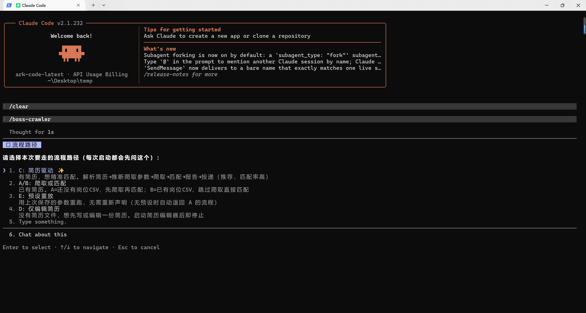

| 路径                      | 触发条件                    | 流程                                                        |
| ------------------------- | --------------------------- | ----------------------------------------------------------- |
| **路径 A** ✨ 简历驱动爬取 | 你有简历、还没爬过岗位      | 上传简历 → 自动推断搜索参数 → 精准爬取 → 匹配 → 投递 |
| **路径 B** 匹配现有数据   | 已有岗位 CSV 数据           | 上传简历 → 加载已有岗位 → 匹配 → 投递                       |
| **路径 C** ✨ 预设重放     | 已有保存的预设参数          | 上传简历 → 加载预设 → 补齐缺失参数 → 精准爬取 → 匹配 → 投递  |
| **路径 D** ✨ 仅简历编辑器 | 没有简历文件，想先写/改简历 | 打开内置 ShowCV 简历编辑器 → 写完后重新进入 A/B/C |

**每条路径都从解析简历开始。** 岗位怎么搜、怎么打分、招呼语怎么写，全部依赖简历里的信息，所以「先爬后匹配」不是一条支持的顺序——没有简历，参数只能靠瞎猜。

**路径 A 是最智能的方式**：简历里已经包含了你的技能方向、工作经验和期望城市，让简历告诉系统该搜什么，而不是盲猜。爬出来的岗位天然与背景对口，匹配命中率更高。

**路径 C 复用上次确认过的预设参数**：经验筛选、薪资、公司规模、最低岗位数等搜索参数在首次确认后已保存为预设，再次使用时直接重放即可，无需重新声明；预设中缺失的参数会自动询问补齐后才开始爬取。适合反复在同一方向求职、不想每次重复填筛选项的场合。

**阶段 D：内置 ShowCV 简历编辑器（路径 D）**:如果你还没有一份简历，可以使用内置的 **ShowCV 简历编辑器**直接在浏览器里排版、写、改简历，实时预览。写完后即可回到路径 A/B/C 继续后面的匹配与投递——编辑器里写的 Markdown 可以直接当简历用，不必再导出 PDF。访问路径可以点击下面的shell展开，如下：

其中的 url 默认为 http://127.0.0.1:3090（端口被占时会自动往后找，实际地址以启动时打印的 `SHOWCV_READY` 那行为准）

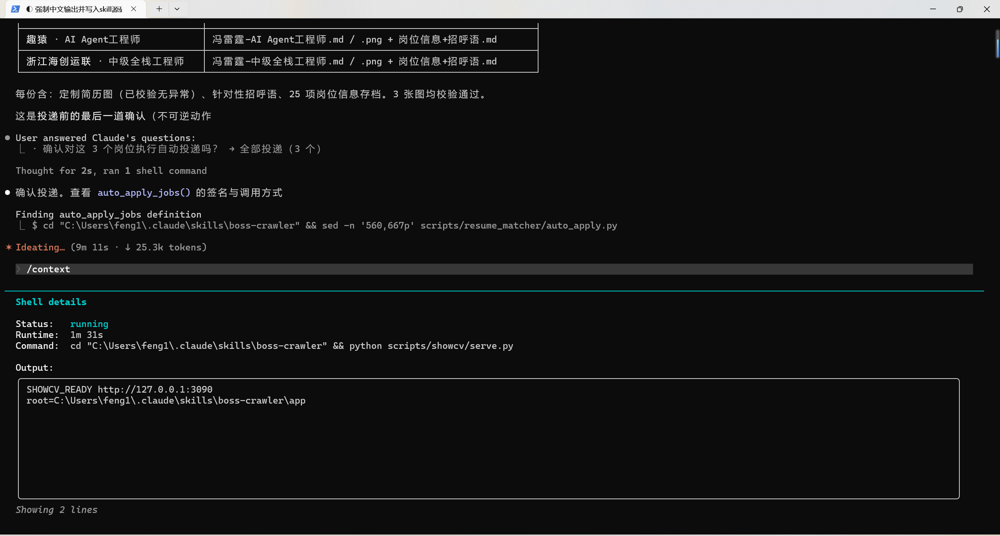

#### 阶段 1：上传简历 & 智能推断搜索参数

```
用户: [上传简历文件]

Claude: 📋 根据你的简历推断：
        - 搜索关键词：Python, 后端开发, AI应用开发, RAG
        - 目标城市：杭州
        - 经验筛选：应届生, 1年以内
        - 薪资筛选：5-10K, 10-20K
        是否按以上参数开始爬取？
```

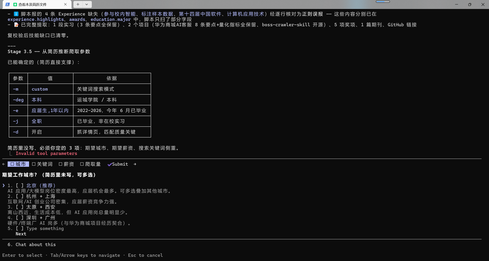

模型深度解析简历内容，提取技能栈、工作年限、期望城市等关键信息，自动映射为 BOSS 直聘的搜索筛选条件。可推断出的参数自动填好，**未知的参数则单独问你确认**——你只需确认或微调，无需手动填写每一个参数。

爬取前 Claude 会把本轮要用的**经验 / 岗位类型 / 薪资 / 公司规模**等筛选参数汇总给你一次性确认，避免流程中途反复打断。确认后的参数会写进 `crawl_params.json`，爬取和匹配都从这一份文件取值。

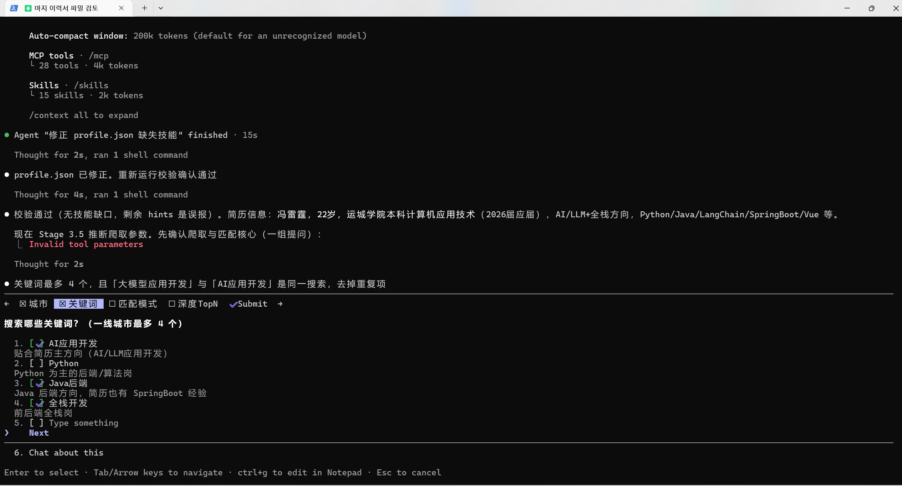

爬虫自动去重（基于 `link` 字段），并把岗位详情（职位名、薪资、公司、JD 描述等）写入 `assets/post_data/**.csv`。以关键词 "Python" + 城市 "杭州" 为例，通常可获取 45+ 个有效岗位。

但同时也可以自定义参数最低岗位数量（min_count）：

爬取结束后，Claude 会对照你设定的**最低岗位数量（min_count）**检查结果。如果爬到的数量不足，会主动停下问你：**换关键词、放宽条件、还是接受现状**——而不是闷头往下跑。

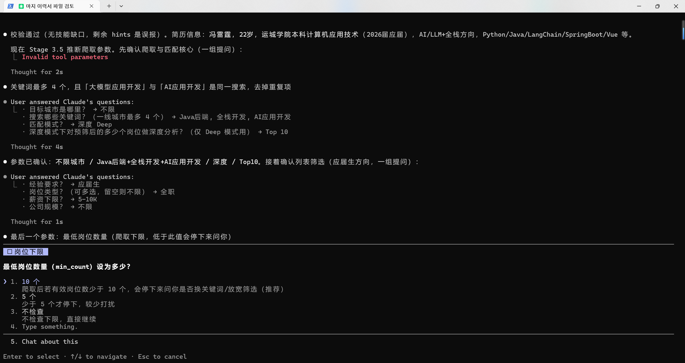

爬取过程中，无论走哪条路径，只要爬到的岗位数量**小于你设定的最低岗位数（min_count）**，Claude 都会主动停下询问你：**扩大搜索范围（放宽城市/薪资/经验）、换关键词、还是接受现状**——而不是闷头往下跑。

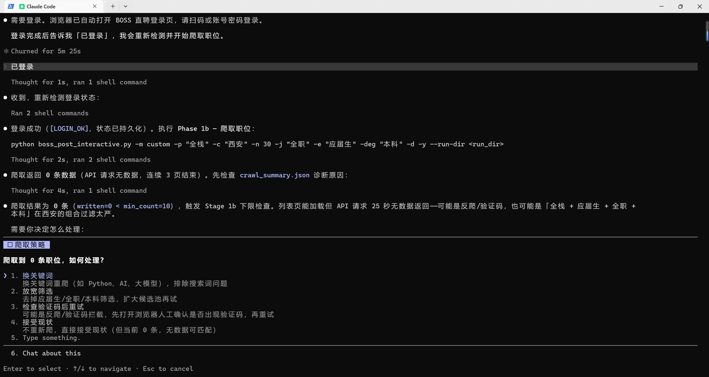

#### 阶段 2：登录检测 & 岗位爬取

首次使用需要先在你的 Chrome 里登录 BOSS 直聘。脚本会打开浏览器并**暂停等待你手动登录**，登录成功后 cookie 持久化，后续无需重复登录。登陆后会自动爬取数据。

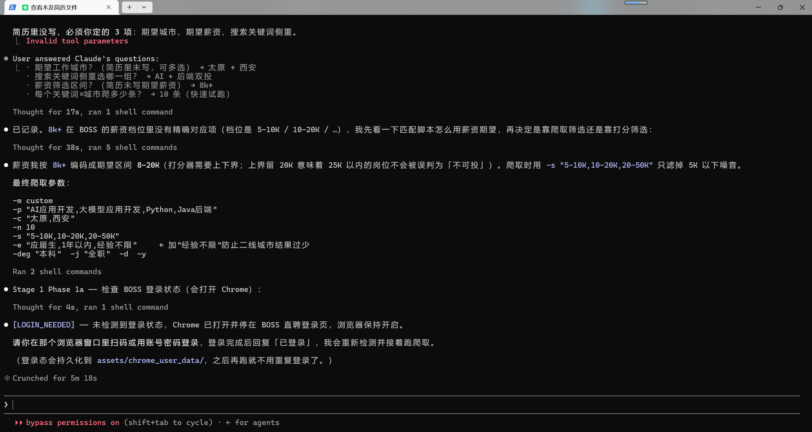

#### 阶段 3：智能匹配 & 评分排名

```
Claude: 📊 分析完成！
        Tier 1 (≥100 高匹配):   12 个
        Tier 2 (≥85 中等):      23 个
        Tier 3 (≥70 低匹配):    30 个

        📋 推荐投递 Top 12：
        | # | 公司 | 职位 | 薪资 | 匹配度 | 难度 |
        |---|------|------|------|--------|------|
        | 1 | XX科技 | Python后端 | 15-25K | 108 | 易 |
        | 2 | YY公司 | AI应用开发 | 12-20K | 102 | 易 |
        ...
        是否确认投递？
```

系统拿着你的简历,跟每个岗位的招聘信息比对,按几项标准打分,最后告诉你这个岗位该不该投、能不能投。

它比什么?

就像 HR 挑人,它也逐项看:

1. 钱够不够(20 分)—— 重合越多分越高;比你要的低,分就低;比你要的高,算"可以冲一冲",给点分但不给满分。
2. 经验够不够(20 分)—— 岗位写着"3-5年",你实际干了几年,一对就知道。够 → 满分;差一点 → 扣点分;差太多 → 低分。岗位写"经验不限/应届" → 直接满分。
3. 学历够不够(15 分)—— 它把学历排了等级(博士>硕士>本科>大专>中专),岗位要求本科,你是本科就达标,满分;要求硕士你只有本科,就是硬伤,直接 0 分。
4. 技能对得上几样(30 分)—— 你简历里写的技能,拿到岗位要求里搜,每对上一个 +5 分。它还很聪明,知道你写"k8s"就是岗位说的"Kubernetes",写"大模型"就是"LLM",能认出来是同一个东西。对了 6 样就封顶。
5. 职位名字沾不沾边(20 分)—— 比如你想干"AI 应用开发",岗位名字里带"AI"或"开发",就加分。

打分只是参考,真正关键的是另一套"能不能投"的判断

光打分不够,因为有的岗位根本不用投。系统有一套硬规矩,踩到任何一条就直接判"别投":

- 学历卡死你(比如硬要硕士,你只有本科)
- 经验差了 3 年以山
- 薪资离你期望差了 8K 以山

没踩硬规矩,又四项(技能够、钱够、学历经验够)都满足 → 直接投。剩下的 → 改一改简历再投。

最后分四档

- 第一档:能直接投的 → 优先投
- 第二档:改改简历能投的 → 给你优化建议(比如"多强调 RAG 实战""把项目成果写具体点")
- 第三档:不推荐,但留在报告里给你看
- 第四档:直接扔了,报告里都不显示

还有个"深度模式"

上面的打分是按固定公式算的,快但死板。深度模式会再多一步:让模型把岗位描述和你的项目读一遍,看是不是真对口(比如你做过"客服机器人",岗位要"智能问答",这层意思光靠关键词搜不出来)。准是更准,但费 token——所以默认先用公式粗筛一遍(`--top N`),只对中奖的那几个岗位才做深度分析,而且中途断了能用 `--resume` 接着跑,已分析过的不重复花钱。

同时生成 Bauhaus 风格 HTML 可视化报告，包含所有岗位的匹配度卡片、分类统计图表和投递状态。


#### 阶段 4：确认投递哪些岗位 & ai调整简历后生成图片 & ai调整招呼语

```
用户: 投递前 5 个
```

Claude 把 Tier 1 榜单和每个岗位的匹配理由列给你，由你决定**投哪些岗位、投几个**。这是防止误投的第一道确认。同时询问你如下内容：

在确认投递哪些岗位时，Claude 会把**投递范围、招呼语生成方式、图片生成方式**三个独立选项在一次提问里一起给你，每个都可单独选择后一次性确认： 

| 可选项             | 可选值                             | 说明                                                         |
| ------------------ | ---------------------------------- | ------------------------------------------------------------ |
| **投递哪些岗位**   | `全部合格岗位` / `我来选` / `取消` | 投 Tier 1 全部，或手动挑选其中几个（按序号，`--only 1,3,5-7`）；取消则终止本次投递 |
| **招呼语生成方式** | `自定义` / `默认` / `AI生成`       | 自定义=你输入一段全岗位共用的招呼语；默认=用内置模板；AI生成=逐个岗位调模型,结合该岗位 JD 与你的简历亮点生成个性化招呼语 |
| **是否发送图片**   | `自定义上传` / `AI调整` / `不发送` | 自定义上传=用你提供的简历图片；AI调整=以你的简历为基底,针对每个岗位定制优化并生成不含个人信息的简历图片；不发送=只发文字招呼语 |

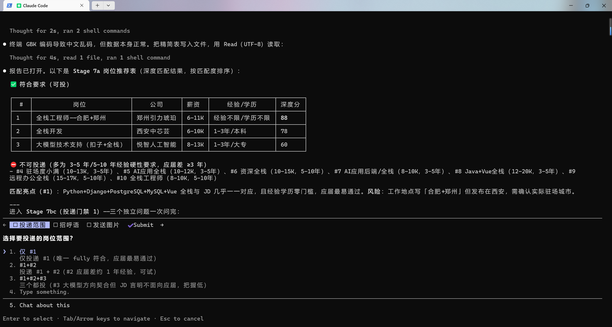

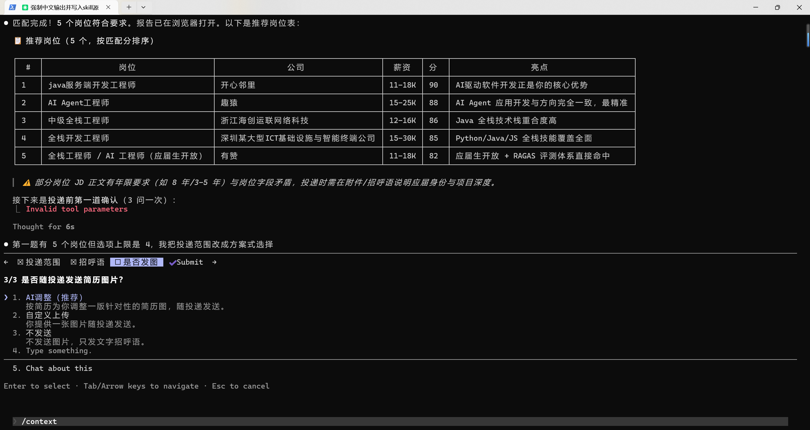

投递前，Claude 会为每个岗位**自动生成一份不含个人信息的简历图片**（只保留技能、项目、教育等求职信息，隐去姓名/电话/邮箱等隐私），并针对该岗位做定制优化。这样既方便持续投递，又避免简历图片被随意分享时泄露隐私。

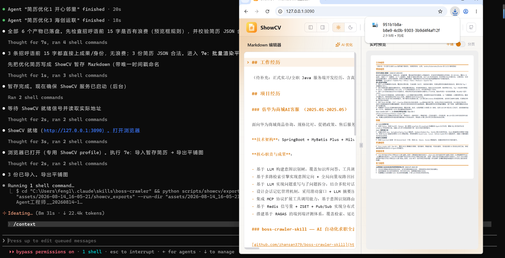

#### 阶段 5：确认发送 & 自动投递

每个岗位会生成一份**个性化招呼语 + 简历图片**。发送前需要你确认——这是第二道、也是投递前最后一道确认。数据存在于 **skill的assets目录\时间戳\applications **。例如我的skill就在：

C:\Users\feng1\ \.claude\skills\boss-crawler\assets\2026-08-14_17-32-26\applications

但同时也可能是当前项目下的\.claude\skills，最简单的方式是 

`/btw 生成的简历和图片在哪里？`

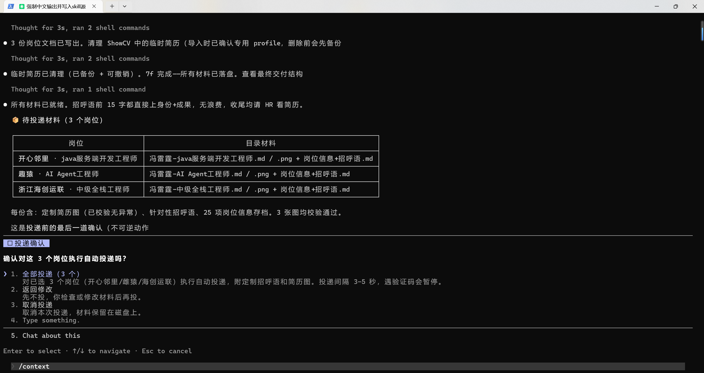


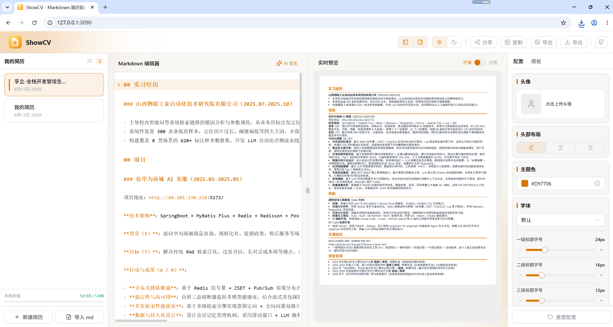

用户确认后，DrissionPage 自动打开浏览器、进入岗位详情页、发送招呼语、上传简历图片。每次投递间隔 3-5 秒以规避反爬，投递结果记录到 `apply_log.json`。

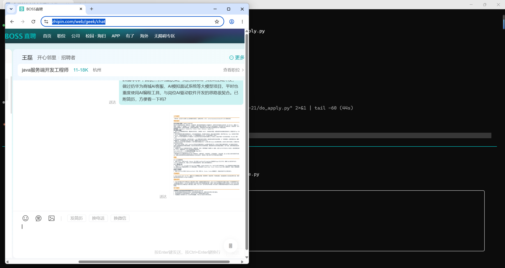

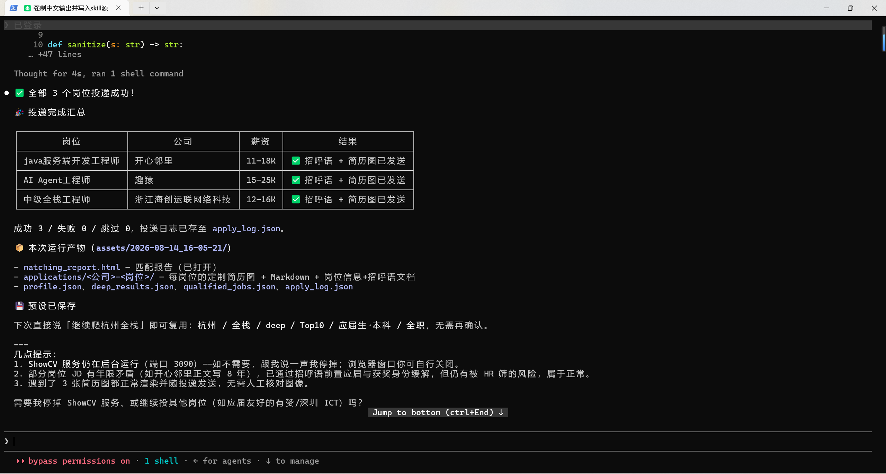

---

### 方式二：命令行（不依赖 Claude Code）

**同一套脚本、同一个模型接口**，只是参数一次给全、不再逐步问你。适合定时任务、批量重跑，或者不想开 Claude Code 的时候。

**完整用法见 [references/cli.md](./references/cli.md)** —— 下面是最短路径（模型配置见上面的安装第 3 步）：

```bash
# 1. 先看要执行什么，不动任何东西
python scripts/pipeline.py 简历.pdf --all --dry-run

# 2. 一条命令跑完：解析简历 → 推断参数 → 爬取 → 匹配 → 生成材料 → 渲染简历图
#    （不给 --all 就只跑一个阶段 —— 下游按岗位烧 token，默认不替你花）
python scripts/pipeline.py 简历.pdf --all --city "杭州,上海" --keywords "Python,后端开发" --count 30

# 3. 投递是单独一步，而且必须显式 --yes（不加就只演练、打印计划和可选公司）
python scripts/apply.py "assets/<时间戳>"                          # 演练，顺便看有哪些公司可选
python scripts/apply.py "assets/<时间戳>" --yes --max 5
python scripts/apply.py "assets/<时间戳>" --yes --company 百度,棱镜数聚   # 只投指定公司
```

> ⚠️ **投递不在流水线上。** `pipeline.py --all` 跑完停在「材料已生成」，只把投递命令打印出来 —— 投递是整条链上唯一不可撤销的一步（消息一发对方立刻收到），不该由「我跑一下全流程」顺手完成。

**默认只跑一个阶段。** 不给 `--to` / `--all` 时，`pipeline.py` 跑完一个阶段就停下并印出下一步的命令 —— `materials` 按岗位调两次模型（招呼语 + 简历优化）、`deep` 按岗位调一次，这些钱不该在「我先跑跑看」时花掉。任何一步失败也能接着跑，流水线会打印确切的续跑命令：

```bash
python scripts/pipeline.py --from crawl                 # 只重跑爬取（自动定位 assets/LATEST.txt）
python scripts/pipeline.py --from crawl --all           # 从爬取起一路跑到底
python scripts/pipeline.py --run-dir "assets/<时间戳>" --from materials
python scripts/where_am_i.py                            # 这一轮跑到哪了、缺什么
```

退出码是可以脚本化的：`0` 成功、`1` 前置条件不满足或整体失败、`2` 参数用错、`3` **部分成功**（产物写了但不齐，比如 20 个岗位里有 2 个模型调用失败）。

单独跑某一阶段（所有脚本都有 `--help`）：

```bash
python scripts/parse_resume.py 简历.pdf                  # → profile.json
python scripts/run_matcher.py --mode quick --profile assets/<ts>/profile.json -o assets/<ts>
python scripts/deep_analyze.py assets/<ts> --limit 3     # 先拿 3 个试水，看看质量和花费
python scripts/gen_materials.py assets/<ts> --only 1,3   # 只补这几个（默认跳过已有产物）
```

两条路径**产物格式完全一致**，可以混着用：Skill 跑到一半接着用命令行续跑同一个运行目录，反过来也行。区别只在**谁来问你**——Skill 路径在投递范围和发送前各有一道确认闸门，命令行路径把这两道换成了显式的 `--only` 和 `--yes`。

---

## 📁 运行数据在哪里 & 你会得到哪些有用的数据


 ！！！Skill目录一般在 **C:\Users\ 用户名 \ .claude\skills** 或者当**前项目的  .claude\skills**


所有运行产物都落在 Skill 目录下，**每次运行独立隔离在一个时间戳子目录** `assets/<timestamp>/`（例如 `assets/2026-08-14_16-05-21/`）。项目根目录另有爬取与登录数据。

### 数据存放位置

| 位置                  | 内容                                                       |
| --------------------- | ---------------------------------------------------------- |
| `assets/post_data/`   | 爬取的岗位 CSV（按关键词/城市分文件，**跨运行累积**）      |
| `assets/chrome_user_data/` | 你的 BOSS 直聘登录 cookie（**含隐私，勿提交 Git / 分享**） |
| `assets/<timestamp>/` | 本次运行的全部产物（简历、匹配、投递、报告）               |

### 在assets/timestamp/目录下 你会得到的有用数据（按用途）

| 数据                  | 路径（均在 `assets/<timestamp>/` 下）                        | 用途                                                     |
| --------------------- | ------------------------------------------------------------ | -------------------------------------------------------- |
| **简历图片**          | `applications/{公司}-{职位}/{姓名}-{职位}.png`               | 不含个人信息的定制简历图片，可直接上传/发送给 HR         |
| **定制简历文本**      | `applications/{公司}-{职位}/{姓名}-{职位}.md`                | 针对该岗位优化过的 Markdown 简历                         |
| **岗位信息 + 招呼语** | `applications/{公司}-{职位}/岗位信息+招呼语.md`              | 该岗位采集信息 + 个性化招呼语，方便你核对/手动发送       |
| **可视化匹配报告**    | `matching_report.html`                                       | 全部岗位的匹配度卡片、分类统计、投递状态，浏览器打开即看 |
| **岗位评分明细**      | `qualified_jobs.json`                                        | 投递候选池：每个岗位的评分、匹配理由、缺失技能、风险提示（自动生成，别手工改——序号是下游对齐键） |
| **投递记录**          | `apply_log.json`                                             | 每次投递的时间、岗位、结果，方便复盘                     |
| **爬取统计**          | `crawl_summary.json`                                         | 本次爬取写入/跳过/去重数量                               |
| **简历解析结果**      | `profile.json` / `profile_validation.json`                   | 结构化简历字段 + 交叉校验结果                            |
| **深度分析明细**      | `deep_candidates.json` / `deep_results.json`                 | LLM 深度匹配的候选与理由                                 |
| **编辑器导出**        | `showcv_exports/` / `showcv_staging/`                        | ShowCV 编辑器导出的简历图片与中间稿                      |
| **阶段耗时**          | `run_timings.jsonl`                                          | 各阶段耗时埋点，便于优化                                 |
| **模型花费**          | `llm_usage.jsonl`                                            | 每次模型调用的 token 与重试次数                          |

> **对你最有用的**是 `applications/{公司}-{职位}/` 下的三件套：定制简历图片、定制简历文本、岗位信息+招呼语——它们就是投递时真正发出去的东西，随时可以手动复用或再次投递。

---

### 

## ✨ 核心能力

| 模块 | 功能 | 亮点 |
|------|------|------|
| 🔍 **岗位爬虫** | BOSS 直聘数据采集 | 关键词搜索、多城市、高级筛选、详情页采集、数量下限校验 |
| 📝 **内置简历编辑器** | ShowCV 浏览器编辑器 | 无需扣简历，直接排版写改 + 实时预览 + 导出 PDF |
| 📄 **简历解析** | PDF/Word/MD/文本 → 结构化 JSON | 模型深度理解，保留量化指标和项目要点，附字典交叉校验 |
| 🎯 **智能匹配** | 双模式评分 | 快速模式（纯规则秒级、零 token）+ 深度模式（LLM 语义分析、按岗位并发、可续跑） |
| 🖼️ **简历图片生成** | 自动生成不含个人信息简历图片 | 针对岗位定制优化 + 自动排版调整 |
| 📊 **可视化报告** | HTML 交互报告 | 双主题、岗位卡片含匹配度/难度/成功概率 |
| 🚀 **自动投递** | DrissionPage 浏览器自动化 | 个性化招呼语 + 简历图片上传 + 投递记录 + 回读校验 |
| 🧩 **双运行路径** | Claude Code Skill ／ 纯命令行 | 同一套脚本、同一个模型接口；支持分阶段续跑、`--dry-run` 预演、投递独立闸门 |


## 🏗️ 架构

```
两条路径，同一套脚本、同一个模型接口、同一份产物：

Skill 路径                              命令行路径
SKILL.md（逐阶段问你确认）               scripts/pipeline.py（参数一次给全）
    └───────────────┬───────────────────────┘
                    ▼
    scripts/llm/              统一的 OpenAI 兼容客户端（三层配置 + 重试 + 并发）
    scripts/prompts/*.st      5 个提示词模板（解析/深度匹配/招呼语/简历优化/参数推断）
    scripts/boss_crawler/     爬取   ──→  assets/post_data/**.csv
    scripts/resume_matcher/   评分   ──→  scored_jobs.json / matching_report.html
                    ▼
        assets/<ts>/qualified_jobs.json  ← 投递候选池（自动生成；收窄用 --only，别改文件）
                    ▼
    apply.py --yes ／ resume_matcher/auto_apply.py   浏览器自动投递

app/ 内置 ShowCV 编辑器 ──→ 简历长图渲染（render_images.py）／ assets/<ts>/showcv_exports/
```

```
boss-crawler/                         # Skill 根目录 (~/.claude/skills/boss-crawler/)
├── SKILL.md                          # 🔑 Skill 定义（编排完整流程）
├── README.md                         # 使用文档
├── requirements.txt                  # 依赖（分「必需」和「按需」两段）
│
├── assets/                           # 📦 运行输出（无需加载到上下文的最终产物）
│   ├── llm_config.json               # 🔑 你的模型配置（api_key 在这里，不进 Git）
│   ├── preferences.json              # 爬取参数预设（路径 C 重放用）
│   ├── post_data/                    # 爬取的岗位 CSV（跨运行累积）
│   ├── chrome_user_data/             # BOSS 直聘登录 cookie（含隐私）
│   ├── LATEST.txt                    # 最近运行指针
│   └── <timestamp>/                  # 每次运行隔离到时间戳子目录
│       ├── profile.json              # 简历结构化解析
│       ├── profile_validation.json   # 简历交叉校验
│       ├── crawl_params.json         # 爬取参数（关键词/城市/筛选项/匹配模式）
│       ├── crawl_summary.json        # 爬取统计（也是「这轮真爬到了」的证据）
│       ├── scored_jobs.json          # 规则评分分档（tier1..tier4）
│       ├── qualified_jobs.json       # 投递候选池（自动生成，序号是下游对齐键）
│       ├── matching_report.html      # HTML 可视化报告
│       ├── deep_candidates.json      # 深度模式候选
│       ├── deep_results.json         # 深度分析结果
│       ├── apply_log.json            # 投递记录
│       ├── resume_text.txt           # 简历纯文本
│       ├── run_timings.jsonl         # 各阶段耗时
│       ├── llm_usage.jsonl           # 每次模型调用的 token 与重试
│       ├── generated/                # 个性化招呼语 / 定制简历 JSON
│       ├── applications/{公司}-{职位}/  # 🎁 定制简历图片 + 定制简历文本 + 岗位信息+招呼语
│       ├── showcv_staging/           # 渲染长图时的中间稿
│       └── showcv_exports/           # ShowCV 编辑器导出（简历图片 zip）
│
├── app/                              # 🌐 内置 ShowCV 简历编辑器（静态站点 + 字体）
│
├── references/                       # 📚 参考文档（按需加载）
│   ├── cli.md                        # 📖 命令行路径完整用法
│   ├── crawl-commands.md             # 爬取命令与参数
│   ├── resume-parsing.md             # 简历解析与交叉校验
│   ├── matching.md                   # 双模式匹配与评分
│   ├── auto-apply.md                 # 招呼语与自动投递
│   ├── resume-editor.md              # 内置简历编辑器
│   └── scripts.md                    # 包/函数参考
│
└── scripts/                          # 🐍 可执行脚本（自包含）
    ├── boss_post_interactive.py      # 爬虫 CLI 入口
    ├── run_matcher.py                # 匹配系统 CLI 入口
    │
    │   ── 命令行路径（每个阶段都能单独跑，详见 references/cli.md）──
    ├── pipeline.py                   # 一条命令串完 9 个阶段（不含投递）
    ├── parse_resume.py               # 简历 → profile.json
    ├── infer_params.py               # profile → crawl_params.json
    ├── deep_analyze.py               # 逐岗位调模型 → deep_results.json
    ├── gen_materials.py              # 招呼语 + 优化简历 → generated/
    ├── verify_no_fabrication.py      # 查材料里有没有简历原文没有的技术词（查到就拦住 render）
    ├── render_images.py              # 简历 JSON → 简历长图（串行，共用一个浏览器）
    ├── apply.py                      # 投递（必须显式 --yes，不加只演练）
    ├── llm_check.py                  # 体检模型配置（打印生效值 + 试发一次）
    ├── llm/                          # OpenAI 兼容客户端（config 三层优先级 + 重试 + 并发）
    │
    │   ── 辅助 ──
    ├── check_artifacts.py            # 材料齐不齐（缺谁的哪一项）
    ├── verify_image.py               # 简历图体检（空白图发出去比不发更糟）
    ├── write_application_md.py       # 组装 applications/ 下的可读投递材料
    ├── read_thin.py                  # 瘦读数据文件（避免撑爆上下文）
    ├── where_am_i.py                 # 从产物反推当前阶段，提示下一步命令
    ├── stage_timer.py                # 阶段计时埋点
    ├── validate_profile.py           # Profile 交叉校验
    ├── test_*.py                     # 离线测试（不发真实请求、不碰浏览器）
    │
    ├── boss_crawler/                 # 爬虫引擎包
    ├── resume_matcher/               # 匹配引擎包（评分/解析/报告/投递/深度分析）
    └── prompts/                      # LLM 提示词模板 (.st)，两条路径共用
        ├── resume_parse.st           #   简历 → 结构化字段
        ├── match_analysis.st         #   岗位深度匹配打分
        ├── greeting.st               #   个性化招呼语
        ├── resume_optimize.st        #   针对岗位优化简历
        └── crawl_params.st           #   简历 → 爬取参数推断
```

> **登录 cookie 与爬取数据都在 `assets/` 下**（`assets/chrome_user_data/`、`assets/post_data/`），由脚本运行时自动创建，整个 `assets/` 已在 `.gitignore` 里。

---


## 🔧 技术栈

| 技术 | 用途 |
|------|------|
| [DrissionPage](https://github.com/g1879/DrissionPage) | Chrome CDP 协议控制，爬虫 + 浏览器自动化 |
| PyPDF2 / python-docx | 简历文件解析（PDF/Word），按需安装 |
| chardet | 文件编码自动检测 |
| requests | OpenAI 兼容接口调用（LLM 客户端，零额外重依赖） |
| Pillow | 投递前给简历图体检（尺寸、内容占比、是否整张空白），按需安装 |
| 任意 OpenAI 兼容接口 | 全部 LLM 能力：DeepSeek / 通义 / 月之暗面 / 智谱 / 火山方舟 / 本地 ollama、vLLM |
| Claude Code | Skill 路径的编排层：选路径、逐阶段确认、投递前把关（不参与模型调用） |
| HTML/CSS/JS | Bauhaus 风格双主题可视化报告 + 内置 ShowCV 编辑器 |

---


## ⚠️ 重要提示

- **合规使用**：请遵守 BOSS 直聘的使用条款，合理控制爬取频率
- **安全投递**：自动投递已内置 3-5 秒间隔和数量限制，请勿修改以规避反爬
- **真实性**：简历优化只基于真实经历，绝不编造虚假内容
- **隐私保护**：`assets/chrome_user_data/` 包含你的登录 cookie、`assets/llm_config.json` 包含你的 api_key，请勿提交到 Git 或分享给他人（整个 `assets/` 已在 `.gitignore` 里）；生成的简历图片已隐去个人信息，但生成的原始简历文本仍含隐私，注意保管
- **验证码**：遇到验证码时脚本会暂停并通知你手动处理

---

## 📄 License

MIT

---

<div align="center">
  <sub>Built with ❤️ using Python + Claude Code</sub>
</div>