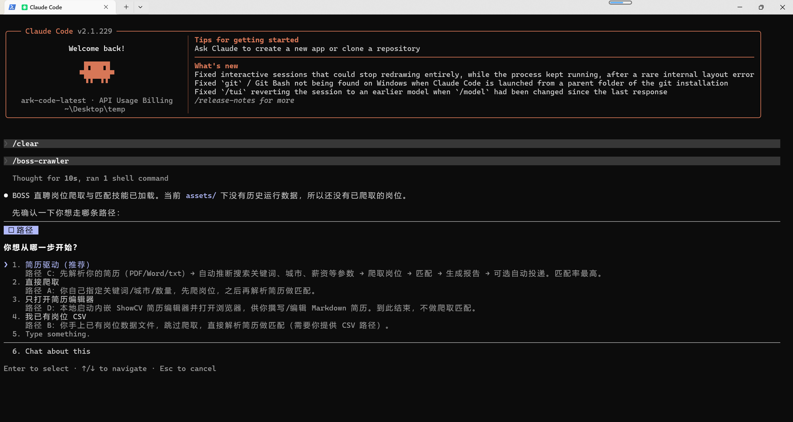

# 🤖 BOSS 直聘岗位爬取与智能投递助手

[](https://www.python.org/)
[](LICENSE)
[](https://claude.ai/code)

> 🚀 **这是一个 Claude Code Skill** — 在 Claude Code 中输入 `/boss-crawler` 即可启动完整的求职自动化流程。

一套完整的 BOSS 直聘求职自动化工具：**爬取岗位 → 解析简历 → 智能匹配 → 可视化报告 → 自动生成简历图片 → 自动投递**。所有 LLM 分析由 Claude Code 自身模型能力完成，帮助你更好**精投简历**。

**最新亮点（2026-08 更新）**：

- ✨ **内置 ShowCV 简历编辑器**（路径 D）——直接在编辑器里写/改简历，无需 PDF 往返
- 🖼️ **自动生成简历图片**——投递时自动生成不含个人信息的简历图片随招呼语一起发送，更醒目
- 🎚️ **新增筛选项**——经验 / 岗位类型 / 薪资 / 公司规模，做成预设一次确认，减少重复提问
- 📉 **岗位下限校验（min_count）**——爬取数量不足时主动停下问你是否换关键词/放宽/接受
- ⚡ **提问次数从 6 次压到 4 次**——更少的打断，更快的流程

## ⚠️ 免责声明
本项目仅供学习和技术研究参考，旨在探讨 Chrome DevTools Protocol、前端反爬机制与数据采集技术。请勿用于任何违反 BOSS直聘用户协议 或相关法律法规的用途，不得用于商业转售、恶意爬取或对目标网站造成负担的行为。使用本项目所产生的一切后果由使用者自行承担，作者不对任何滥用行为负责。

## 搜集的投递技巧
[在boss直聘如何打招呼语](Tutorial/Greeting.md)

[在boss直聘什么时候打招呼](Tutorial/DeliveryTime.md)

### 海投 vs 精准投递

| 策略 | 其他插件 | 本 Skill |
|---|---|---|
| **投递模式** | 批量点击、统一招呼语 | 先匹配 → 只投高匹配岗位 |
| **招呼语** | 固定模板 | 逐个岗位个性化生成（结合简历亮点 + JD 关键词） |
| **简历附件** | 仅 PDF/DOC | 额外生成**不含个人信息的简历图片**，随招呼语一起更醒目 |
| **频率控制** | 通常无节制，易被风控 | 每次间隔 3-5 秒，模拟正常人工操作 |

---

## 📦 安装

### 方式一：让 Claude Code 自动安装（推荐）

在 Claude Code 中输入：

```
请帮我安装这个 skill：https://github.com/zhansan379/boss-crawler-skill.git
```

Claude 会自动克隆仓库、安装依赖、注册 skill。完成后输入 `/boss-crawler` 即可使用。


### 方式二：手动安装

```bash
# 1. 克隆仓库
git clone https://github.com/zhansan379/boss-crawler-skill.git ~/.claude/skills/boss-crawler
```

> 仓库 `main` 分支即最新稳定版；`feat/showcv-resume-editor` 为内置简历编辑器试验分支，可 `git checkout feat/showcv-resume-editor` 体验。

然后用 Claude Code 打开项目目录，输入 `/boss-crawler` 即可。


---

## 🗺️ 使用方式

### 方式一：Claude Code Skill（推荐）

Skill 启动后，Claude 首先检测你当前的数据状态——有没有简历、有没有已爬取的岗位 CSV——并根据检测结果自动选择路径，引导你进入下一步。



| 路径 | 触发条件 | 流程 |
|------|---------|------|
| **路径 C** ✨ 简历驱动爬取 | 你有简历、还没爬过岗位 | 上传简历 → Claude 自动推断搜索参数 → 精准爬取 → 匹配 → 投递 |
| **路径 B** 匹配现有数据 | 已有岗位 CSV 数据 | 上传简历 → 加载已有岗位 → 匹配 → 投递 |
| **路径 A** 先爬后匹配 | 首次使用、无任何数据 | 手动指定搜索条件 → 爬取 → 上传简历 → 匹配 → 投递 |
| **路径 D** ✨ 仅简历编辑器 | 没有简历文件，想先写/改简历 | 打开内置 ShowCV 简历编辑器 → 写完导出 PDF 后重新进入 A/B/C |

**路径 C 是最智能的方式**：简历里已经包含了你的技能方向、工作经验和期望城市，让简历告诉系统该搜什么，而不是盲猜。爬出来的岗位天然与背景对口，匹配命中率更高。

#### 阶段 1：上传简历 & 智能推断搜索参数

```
用户: [上传简历文件]

Claude: 📋 根据你的简历推断：
        - 搜索关键词：Python, 后端开发, AI应用开发, RAG
        - 目标城市：杭州
        - 经验筛选：应届生, 1年以内
        - 薪资筛选：5-10K, 10-20K
        是否按以上参数开始爬取？
```


Claude 深度解析简历内容，提取技能栈、工作年限、期望城市等关键信息，自动映射为 BOSS 直聘的搜索筛选条件。可推断出的参数自动填好，**未知的参数则单独问你确认**——你只需确认或微调，无需手动填写每一个参数。

爬取前 Claude 会把本轮要用的**经验 / 岗位类型 / 薪资 / 公司规模**等筛选参数汇总给你一次性确认，避免流程中途反复打断。


爬虫自动去重（基于 `link` 字段），并把岗位详情（职位名、薪资、公司、JD 描述等）写入 `post_data/*.csv`。以关键词 "Python" + 城市 "杭州" 为例，通常可获取 30+ 个有效岗位（boss直聘动态加载，一般都在45个岗位+）。

但同时也可以自定义参数最低岗位数量（min_count）：

爬取结束后，Claude 会对照你设定的**最低岗位数量（min_count）**检查结果。如果爬到的数量不足，会主动停下问你：**换关键词、放宽条件、还是接受现状**——而不是闷头往下跑。


#### 阶段 2：登录检测

首次使用需要先在你的 Chrome 里登录 BOSS 直聘。脚本会打开浏览器并**暂停等待你手动登录**，登录成功后 cookie 持久化，后续无需重复登录。


#### 阶段 D：内置 ShowCV 简历编辑器（路径 D）

如果你还没有一份简历，可以使用内置的 **ShowCV 简历编辑器**直接在浏览器里排版、写、改简历，实时预览。写完导出 PDF 后，即可回到路径 A/B/C 继续后面的匹配与投递。


#### 阶段 4：智能匹配 & 评分排名

```
Claude: 📊 分析完成！
        Tier 1 (≥100 高匹配):   12 个
        Tier 2 (≥85 中等):      23 个
        Tier 3 (≥70 低匹配):    30 个

        📋 推荐投递 Top 12：
        | # | 公司 | 职位 | 薪资 | 匹配度 | 难度 |
        |---|------|------|------|--------|------|
        | 1 | XX科技 | Python后端 | 15-25K | 108 | 易 |
        | 2 | YY公司 | AI应用开发 | 12-20K | 102 | 易 |
        ...
        是否确认投递？
```

先由 Python 规则引擎对全部岗位做快速初筛（薪资、经验、学历、技能词边界匹配 + 别名归一化），再对候选岗位执行 Claude 语义深度分析（JD 职责与简历项目的实质匹配、技术栈契合度）。6 维度评分（薪资/经验/学历/技能/职位相关/AI 优势，满分 115）后按 4 层分类归档：Tier 1（≥100）高匹配直接投递，Tier 2（≥85）中等匹配优化后投递，Tier 3（≥70）低匹配不推荐，Tier 4 自动丢弃。同时生成 Bauhaus 风格 HTML 可视化报告，包含所有岗位的匹配度卡片、分类统计图表和投递状态。


#### 阶段 5：确认投递哪些岗位

```
用户: 投递前 5 个
```

Claude 把 Tier 1 榜单和每个岗位的匹配理由列给你，由你决定**投哪些岗位、投几个**。这是防止误投的第一道确认。


#### 阶段 6：自动生成简历图片

投递前，Claude 会为每个岗位**自动生成一份不含个人信息的简历图片**（只保留技能、项目、教育等求职信息，隐去姓名/电话/邮箱等隐私），并针对该岗位做定制优化。这样既方便持续投递，又避免简历图片被随意分享时泄露隐私。


在正式发送前，Claude 还会**自动调整简历图片的排版与细节**，确保生成效果整洁、可读、匹配该岗位。


#### 阶段 7：确认发送 & 自动投递

每个岗位会生成一份**个性化招呼语 + 简历图片**。发送前需要你确认——这是第二道、也是投递前最后一道确认。


```
Claude: [逐个生成个性化招呼语 → 用户确认 → 浏览器自动投递]
        ✅ 投递完成！3/3 成功
        📄 报告已生成: assets/2026-08-14_16-05-21/matching_report.html
```

用户确认后，DrissionPage 自动打开浏览器、进入岗位详情页、发送招呼语、上传简历图片。每次投递间隔 3-5 秒以规避反爬，投递结果记录到 `apply_log.json`。


---

## 📁 运行数据在哪里 & 你会得到哪些有用的数据

所有运行产物都落在 Skill 目录下，**每次运行独立隔离在一个时间戳子目录** `assets/<timestamp>/`（例如 `assets/2026-08-14_16-05-21/`）。项目根目录另有爬取与登录数据。

### 数据存放位置

| 位置 | 内容 |
|------|------|
| `post_data/` | 爬取的岗位 CSV（按关键词/城市分文件） |
| `chrome_user_data/` | 你的 BOSS 直聘登录 cookie（**含隐私，勿提交 Git / 分享**） |
| `assets/<timestamp>/` | 本次运行的全部产物（简历、匹配、投递、报告） |

### 你会得到的有用数据（按用途）

| 数据 | 路径（均在 `assets/<timestamp>/` 下） | 用途 |
|------|------|------|
| 🖼️ **简历图片** | `applications/{公司}-{职位}/{姓名}-{职位}.png` | 不含个人信息的定制简历图片，可直接上传/发送给 HR |
| 📝 **定制简历文本** | `applications/{公司}-{职位}/{姓名}-{职位}.md` | 针对该岗位优化过的 Markdown 简历 |
| 💬 **岗位信息 + 招呼语** | `applications/{公司}-{职位}/岗位信息+招呼语.md` | 该岗位采集信息 + 个性化招呼语，方便你核对/手动发送 |
| 📊 **可视化匹配报告** | `matching_report.html` | 全部岗位的匹配度卡片、分类统计、投递状态，浏览器打开即看 |
| 🎯 **岗位评分明细** | `qualified_jobs.json` | 每个岗位的评分、匹配理由、缺失技能、风险提示 |
| 🧾 **投递记录** | `apply_log.json` | 每次投递的时间、岗位、结果，方便复盘 |
| 📈 **爬取统计** | `crawl_summary.json` | 本次爬取写入/跳过/去重数量 |
| 📄 **简历解析结果** | `profile.json` / `profile_validation.json` | 结构化简历字段 + 交叉校验结果 |
| 🤖 **深度分析明细** | `deep_candidates.json` / `deep_results.json` / `deep_shards/` | LLM 深度匹配的候选与理由 |
| 🛠️ **编辑器导出** | `showcv_exports/` / `showcv_staging/` | ShowCV 编辑器导出的简历图片与中间稿 |
| ⏱️ **阶段耗时** | `run_timings.jsonl` | 各阶段耗时埋点，便于优化 |

> **对你最有用的**是 `applications/{公司}-{职位}/` 下的三件套：定制简历图片、定制简历文本、岗位信息+招呼语——它们就是投递时真正发出去的东西，随时可以手动复用或再次投递。

---

### 方式二：独立命令行工具

Skill 中的每个阶段也可以作为独立 Python 脚本运行，不依赖 Claude Code：

```bash
# 爬取岗位
python scripts/boss_post_interactive.py -m custom -p "Python" -c "北京" -n 20 -d -y

# 快速匹配（纯规则，零 token 消耗）
python scripts/run_matcher.py --mode quick --profile assets/<ts>/profile.json

# 深度匹配（规则预筛选 + LLM 语义分析）
python scripts/run_matcher.py --mode deep --profile assets/<ts>/profile.json --top 15
```

---

## ✨ 核心能力

| 模块 | 功能 | 亮点 |
|------|------|------|
| 🔍 **岗位爬虫** | BOSS 直聘数据采集 | 关键词搜索、多城市并发、高级筛选、详情页采集、数量下限校验 |
| 📝 **内置简历编辑器** | ShowCV 浏览器编辑器 | 无需扣简历，直接排版写改 + 实时预览 + 导出 PDF |
| 📄 **简历解析** | PDF/Word/MD/文本 → 结构化 JSON | Claude 深度理解，保留量化指标和项目要点 |
| 🎯 **智能匹配** | 双模式评分 | 快速模式（纯规则秒级）+ 深度模式（LLM 语义分析、并行分片） |
| 🖼️ **简历图片生成** | 自动生成不含个人信息简历图片 | 针对岗位定制优化 + 自动排版调整 |
| 📊 **可视化报告** | HTML 交互报告 | 双主题、岗位卡片含匹配度/难度/成功概率 |
| 🚀 **自动投递** | DrissionPage 浏览器自动化 | 个性化招呼语 + 简历图片上传 + 投递记录 + 回读校验 |

### 🎯 6 维度评分体系（0-115 分）

| 维度 | 分值 | 说明 |
|------|------|------|
| 💰 薪资匹配 | 0-20 | JD 薪资区间与期望区间的重叠度 |
| 📅 经验匹配 | 0-20 | JD 年限要求 vs 实际工作年限 |
| 🎓 学历匹配 | 0-15 | 学历要求匹配 |
| 🔧 技能重合 | 0-30 | 词边界匹配 + 40+ 技能别名归一化 |
| 🏷️ 职位相关 | 0-20 | 岗位名与目标关键词的相关度 |
| 🤖 AI 优势 | 0-10 | RAG/Agent/LLM 等 AI 关键词梯度加分 |

### 📊 4 层岗位分类

```
Tier 1 (≥100 分) → 高匹配，可直接投递   ✅
Tier 2 (≥85 分)  → 中等匹配，优化后投递  ⚡
Tier 3 (≥70 分)  → 低匹配，不推荐       ❌
Tier 4 (<70 分)  → 不匹配，自动丢弃     ⛔
```

---

## 🏗️ 架构

```
SKILL.md (Claude Code Skill 定义 — 编排完整流程)
    │
    ├─ Stage 1: scripts/boss_crawler/  ──→  post_data/*.csv
    ├─ Stage 2-3: Claude 自身  ──→  assets/<ts>/profile.json
    ├─ Stage 4-6: scripts/run_matcher.py ──→ 规则评分 + LLM 语义分析，
    │                                       并直接写出 assets/<ts>/matching_report.html
    ├─ Stage 7: scripts/resume_matcher/auto_apply.py ──→  浏览器自动投递
    │                                                  （个性化招呼语 + 简历图片）
    └─ Stage 0/Path D: app/ 内置 ShowCV 编辑器 ──→ assets/<ts>/showcv_exports/
```

```
boss-crawler/                         # Skill 根目录 (~/.claude/skills/boss-crawler/)
├── SKILL.md                          # 🔑 Skill 定义（编排完整流程）
├── README.md                         # 使用文档
│
├── assets/                           # 📦 运行输出（无需加载到上下文的最终产物）
│   ├── LATEST.txt                    # 最近运行指针
│   └── <timestamp>/                  # 每次运行隔离到时间戳子目录
│       ├── profile.json              # 简历结构化解析
│       ├── profile_validation.json   # 简历交叉校验
│       ├── qualified_jobs.json       # 高分岗位评分明细（含匹配理由/风险）
│       ├── matching_report.html      # HTML 可视化报告
│       ├── deep_candidates.json      # 深度模式候选
│       ├── deep_results.json         # Claude 深度分析结果
│       ├── deep_shards/              # 并行分片分析中间稿
│       ├── apply_log.json            # 投递记录
│       ├── crawl_summary.json        # 爬取统计
│       ├── resume_text.txt           # 简历纯文本
│       ├── generated/                # 个性化招呼语 / 定制简历 JSON
│       ├── applications/{公司}-{职位}/  # 🎁 定制简历图片 + 定制简历文本 + 岗位信息+招呼语
│       └── showcv_exports/           # ShowCV 编辑器导出（简历图片 zip）
│
├── app/                              # 🌐 内置 ShowCV 简历编辑器（静态站点 + 字体）
│
├── references/                       # 📚 参考文档（按需加载）
│   ├── crawl-commands.md             # 爬取命令与参数
│   ├── resume-parsing.md             # 简历解析与交叉校验
│   ├── matching.md                   # 双模式匹配与评分
│   ├── auto-apply.md                 # 招呼语与自动投递
│   ├── resume-editor.md              # 内置简历编辑器
│   └── scripts.md                    # 包/函数参考
│
└── scripts/                          # 🐍 可执行脚本（自包含）
    ├── boss_post_interactive.py      # 爬虫 CLI 入口
    ├── run_matcher.py                # 匹配系统 CLI 入口
    ├── read_thin.py                  # 瘦读数据文件（避免撑爆上下文）
    ├── where_am_i.py                 # 从产物反推当前阶段，提示下一步命令
    ├── stage_timer.py                # 阶段计时埋点
    ├── validate_profile.py           # Profile 交叉校验
    ├── boss_crawler/                 # 爬虫引擎包
    ├── resume_matcher/               # 匹配引擎包（评分/解析/报告/投递/深度分析）
    └── prompts/                      # LLM 提示词模板 (.st)
```

> **项目根目录**还包含运行时数据目录：`post_data/`（爬取数据）、`chrome_user_data/`（登录 cookie），这些不属于 skill 本身，由脚本在运行时自动创建。

---

## 🔧 技术栈

| 技术 | 用途 |
|------|------|
| [DrissionPage](https://github.com/g1879/DrissionPage) | Chrome CDP 协议控制，爬虫 + 浏览器自动化 |
| PyPDF2 / python-docx | 简历文件解析（PDF/Word） |
| chardet | 文件编码自动检测 |
| Claude Code | LLM 分析引擎：简历语义解析、岗位深度匹配、简历优化 |
| HTML/CSS/JS | Bauhaus 风格双主题可视化报告 + 内置 ShowCV 编辑器 |

---

## ⚠️ 重要提示

- **合规使用**：请遵守 BOSS 直聘的使用条款，合理控制爬取频率
- **安全投递**：自动投递已内置 3-5 秒间隔和数量限制，请勿修改以规避反爬
- **真实性**：简历优化只基于真实经历，绝不编造虚假内容
- **隐私保护**：`chrome_user_data/` 包含你的登录 cookie，请勿提交到 Git 或分享给他人；生成的简历图片已隐去个人信息，但生成的原始简历文本仍含隐私，注意保管
- **验证码**：遇到验证码时脚本会暂停并通知你手动处理

---

## 📄 License

MIT

---

<div align="center">
  <sub>Built with ❤️ using Python + Claude Code</sub>
</div>