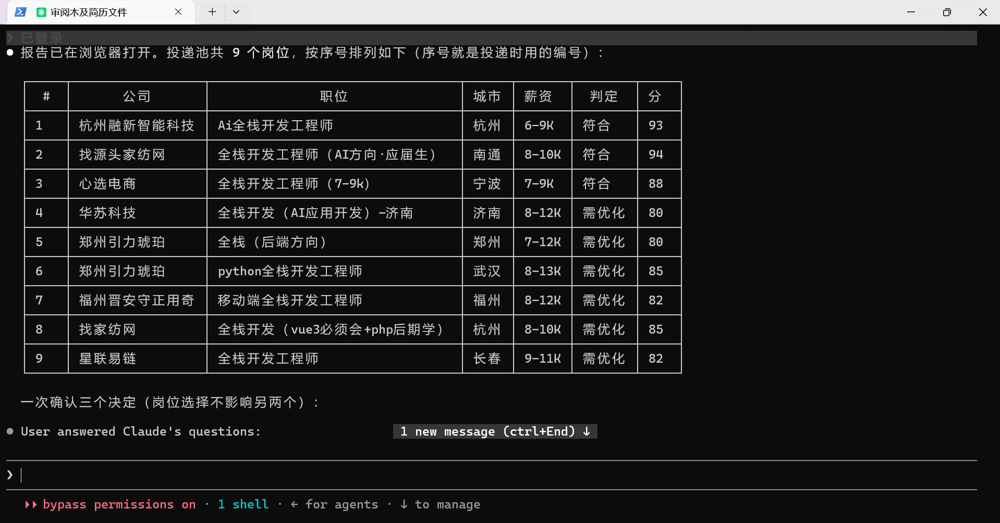

# 🤖 BOSS 直聘岗位爬取与智能投递助手

[](https://www.python.org/)
[](LICENSE)
[](https://claude.ai/code)

> 🚀 **这是一个 Claude Code Skill** — 在 Claude Code 中输入 `/boss-crawler` 即可启动完整的求职自动化流程。

【ai优化简历和招呼语存在bug（纯瞎编），项目以回滚。如需使用，建议手动上传招呼语/简历图片，等我再改改】

【vibecoding害人，写代码一定要看代码！！！！】


一套完整的 BOSS 直聘求职自动化工具：**爬取岗位 → 解析简历 → 智能匹配 → 可视化报告 → 根据岗位要求优化简历,生成图片+招呼语 → 自动投递**。所有 LLM 分析走**你自己配置的模型接口**——默认原生 Anthropic Messages（Claude Code 协议），同样兼容 OpenAI 格式的端点（DeepSeek / 通义 / 月之暗面 / 智谱 / 火山方舟 / 本地 ollama、vLLM 都行）——帮助你更好**精投简历**。

我单独部署的内置简历编辑器 https://www.testtesttesttesttesttest.fun/

## 运行图片




## ⚠️ 免责声明
本项目仅供学习和技术研究参考，旨在探讨 Chrome DevTools Protocol、前端反爬机制与数据采集技术。请勿用于任何违反 BOSS直聘用户协议 或相关法律法规的用途，不得用于商业转售、恶意爬取或对目标网站造成负担的行为。使用本项目所产生的一切后果由使用者自行承担，作者不对任何滥用行为负责。

## 💬 投递技巧

[如何跟 HR 打招呼](Tutorial/Greeting.md) 

[什么时候打招呼回复率最高](Tutorial/DeliveryTime.md)

| 策略 | 其他插件 | 本 Skill |
|---|---|---|
| **投递模式** | 批量点击、统一招呼语 | 先匹配 → 只投高匹配岗位 |
| **招呼语** | 固定模板 | 逐个岗位个性化生成（结合简历亮点 + JD 关键词） |
| **简历附件** | 仅 PDF/DOC | 额外生成**不含个人信息的简历图片**，随招呼语一起更醒目 |
| **频率控制** | 通常无节制，易被风控 | 每次间隔 3-5 秒，模拟正常人工操作 |

---

## 📦 安装

### 方式一：让 Claude Code 自动安装（推荐）

在 Claude Code 中输入：

```
请帮我安装这个 skill：https://github.com/zhansan379/boss-crawler-skill.git
```

Claude 会自动克隆仓库、安装依赖、注册 skill。装完还要**填一次模型配置**（`assets/llm_config.json` 里的 `base_url` / `api_key` / `model`，见下面手动安装第 3 步）——api_key 只有你自己有，这步没法替你做。配好后输入 `/boss-crawler` 即可使用。


### 方式二：手动安装

```bash
# 1. 克隆仓库
git clone https://github.com/zhansan379/boss-crawler-skill.git ~/.claude/skills/boss-crawler

# 2. 装依赖（Python 3.8+，另需本机已装 Chrome）
pip install -r ~/.claude/skills/boss-crawler/requirements.txt

# 3. 配模型（必需，两条路径都要）
cd ~/.claude/skills/boss-crawler
cp assets/llm_config.example.json assets/llm_config.json   # 填 base_url / api_key / model
python scripts/utils/llm_check.py                                # 验一下通不通（api_key 打码显示）
```

> **第 3 步不能省。** 简历解析、深度匹配、招呼语、简历优化都要调模型；没配好，流程第一步就会停下。三层配置优先级：命令行参数 > 环境变量（`LLM_*`，其次 `OPENAI_*`/`ANTHROPIC_*`）> `assets/llm_config.json`。`llm_check.py --no-call` 只查配置、不发请求，不花钱。
>
> **协议默认 `anthropic`**（能自动切到 OpenAI 兼容端点），按阶段用不同模型用配置里的 `stages` 段。详情见 [references/cli.md 配置模型](./references/cli.md)。

然后用 Claude Code 打开项目目录，输入 `/boss-crawler` 即可。**只想用命令行、不用 Claude Code？** 克隆到任意目录即可（不必放进 `~/.claude/skills/`），用法见 [docs/usage-cli.md](./docs/usage-cli.md)。

---

## 🗺️ 使用方式

**两种运行方式，同一套脚本、同一个模型接口、同一份产物**：`/boss-crawler` Skill 路径由 Claude 逐阶段问你确认；命令行路径参数一次给全、可定时重跑。

| 路径                      | 触发条件                    | 流程                                                        |
| ------------------------- | --------------------------- | ----------------------------------------------------------- |
| **路径 A** ✨ 简历驱动爬取 | 你有简历、还没爬过岗位      | 上传简历 → 自动推断搜索参数 → 精准爬取 → 匹配 → 投递 |
| **路径 B** 匹配现有数据   | 已有岗位 CSV 数据           | 上传简历 → 加载已有岗位 → 匹配 → 投递                       |
| **路径 C** ✨ 预设重放     | 已有保存的预设参数          | 上传简历 → 加载预设 → 补齐缺失参数 → 精准爬取 → 匹配 → 投递  |
| **路径 D** ✨ 仅简历编辑器 | 没有简历文件，想先写/改简历 | 打开内置 ShowCV 简历编辑器 → 写完后重新进入 A/B/C |

- 📖 方式一（Skill）完整图文走查 → [docs/usage-skill.md](./docs/usage-skill.md)
- ⌨️ 方式二（命令行）上手 → [docs/usage-cli.md](./docs/usage-cli.md) · 完整参数参考 → [references/cli.md](./references/cli.md)

> 💡 命令行完整流程，按下表的执行顺序排好。下面每个 `python …` 里的运行目录
> `D:\…\assets\2026-08-18_22-10-50` 是**你某次运行的时间戳子目录**（`assets/<ts>/`），
> 请换成你自己的实际目录。所有命令把同一个运行目录作为输入，一环扣一环、依赖前一步的产物。

```bash
# ════════════════════════════════════════════════════════════
# 0. 配置环境（一次性；前四行严格按「建项目→建 venv→激活→装 pip」来）
# ════════════════════════════════════════════════════════════
uv init -p 3.12
uv venv
.venv\Scripts\activate                       # 激活虚拟环境（是 activate，别漏 e）
uv add pip
uv pip install -r requirements.txt           # 装齐运行依赖
```

```bash
# ════════════════════════════════════════════════════════════
# 1. 保存登录状态 —— 爬取和投递都复用这次登录，不用重复扫码
# ════════════════════════════════════════════════════════════
python scripts/stages/boss_post_interactive.py --ensure-login

# ════════════════════════════════════════════════════════════
# 2. 指定简历 → 解析出结构化信息（产出 profile.json，供下面 infer 用）
# ════════════════════════════════════════════════════════════
python scripts/pipeline.py "D:\Download\browserDownload\简历.md" --to parse

# ════════════════════════════════════════════════════════════
# 3. 依据简历推断爬取参数 → 产出 state/crawl_params.json
#    （step 4 的爬取就照着这份参数去搜，所以它必须排在这之前）
# ════════════════════════════════════════════════════════════
python scripts/pipeline.py --run-dir "D:\Project\pythonProject\boss-crawler-skill\assets\2026-08-18_22-10-50" --from infer

# ════════════════════════════════════════════════════════════
# 4. 照着 crawl_params.json 爬取岗位数据（一次几十分钟，靠前段已登录身份）
# ════════════════════════════════════════════════════════════
python scripts/pipeline.py --run-dir "D:\Project\pythonProject\boss-crawler-skill\assets\2026-08-18_22-10-50" --from crawl

# ════════════════════════════════════════════════════════════
# 5. 深度匹配 —— 大模型逐岗位分析「规则评分最高的前 20 名」：
#    --match-mode deep  调用大模型（不写就是纯规则 quick）
#    --top-n 20         进模型的候选岗位数
#    --workers 4        并发线程数（越大越快，也越易触发限流）
# ════════════════════════════════════════════════════════════
python scripts/pipeline.py --run-dir "D:\Project\pythonProject\boss-crawler-skill\assets\2026-08-18_22-10-50" --from match --match-mode deep --top-n 20 --workers 4

# ════════════════════════════════════════════════════════════
# 6. AI 生成「招呼语 + 优化简历」（默认即 AI，会按岗位调模型）
#    --force 覆盖已有产物；只想生成其中一种就跳过另一种：
#       --resume-mode skip   只生成招呼语（不动简历 JSON）
#       --greeting-mode skip 只生成简历（不动招呼语）
#    ⚠ 两个 skip 不能同时给——都跳了就没活干，命令会报错
# ════════════════════════════════════════════════════════════
python scripts/stages/gen_materials.py "D:\Project\pythonProject\boss-crawler-skill\assets\2026-08-18_22-10-50" --force

# ════════════════════════════════════════════════════════════
# 6b. 渲染简历长图 —— 把上一步的 resume JSON 变成可看的 PNG
#     （可整批：直接跑下面的；想要挑几个就加 --only 1,3,5-7）
# ════════════════════════════════════════════════════════════
python scripts/deliver/render_images.py "D:\Project\pythonProject\boss-crawler-skill\assets\2026-08-18_22-10-50"

# ════════════════════════════════════════════════════════════
# 7. 投递（真发不可撤回；不加 --yes 只徒演、把要投的清单列出来）
#    --image <path>     整批统一用你自己这张图（建议绝对路径）
#    --greeting <文本>  整批统一用这条招呼语（覆盖各岗位自己的）
#    ⚠ 想用 AI 生成的图/话就删掉这两个开关 —— 不用它们时 apply 直接用渲染好的
# ════════════════════════════════════════════════════════════
python scripts/deliver/apply.py "D:\Project\pythonProject\boss-crawler-skill\assets\2026-08-18_22-10-50" --yes \
    --image "D:\绝对路径\my_resume.png" \
    --greeting "26届本科可实习6个月，做过百万并发服务重构，盼面聊。"
```

**🔎 AI 生成的内容（步骤 6 / 6b）去哪看** —— 全在运行目录 `assets/<ts>/` 下：

| 内容 | 位置 | 说明 |
|---|---|---|
| 招呼语正文 | `materials/greeting_{i}_{公司}.txt` | 每条一个文件，`{i}` 是岗位 1-based 序号 |
| 优化简历 JSON | `materials/resume_{i}_{公司}.json` | AI 改稿的原始结构（含 `optimized_resume` 全文） |
| 岗位信息 + 招呼语（人眼可读汇总） | `deliver/#N-公司-岗位/岗位信息+招呼语.md` | 每个岗位一份的最终投递文案 |
| 优化建议（给 AI 改的要点） | `deliver/#N-公司-岗位/优化建议.md` | — |
| 简历长图 | `deliver/#N-公司-岗位/姓名-岗位.png` | 步骤 6b 渲出的，HR 看到的就是这个文件 |

> 上面这几份 md/图在走**整条 `--to render`** 会自动落好；如果只单跑 `gen_materials.py`（步骤 6），`岗位信息+招呼语.md` 不会自动生成，需要另跑
> `python scripts/deliver/write_application_md.py "<run_dir>" --all` 才有那份人眼可读汇总。

---

## 📁 运行数据在哪里

Skill 目录一般在 `C:\Users\用户名\.claude\skills` 或当前项目的 `.claude\skills`。所有运行产物落在 Skill 目录下，**每次运行隔离在一个时间戳子目录** `assets/<timestamp>/`（例如 `assets/2026-08-14_16-05-21/`）。对你最有用的是 `deliver/#N-{公司}-{职位}/` 三件套：**定制简历图片 + 岗位信息+招呼语.md + 优化建议.md**。

完整产物清单见 [docs/outputs.md](./docs/outputs.md)。

> 🔒 **隐私**：`assets/chrome_user_data/` 含登录 cookie、`assets/llm_config.json` 含 api_key，勿提交 Git / 分享（整个 `assets/` 已在 `.gitignore`）。生成的简历图片已隐去个人信息，但原始简历文本仍含隐私，注意保管。

---

## ✨ 核心能力

| 模块 | 功能 | 亮点 |
|------|------|------|
| 🔍 **岗位爬虫** | BOSS 直聘数据采集 | 关键词搜索、多城市、高级筛选、详情页采集、数量下限校验、访问间隔随机抖动 + 分批冷却对抗风控 |
| 📝 **内置简历编辑器** | ShowCV 浏览器编辑器 | 无需扣简历，直接排版写改 + 实时预览 + 导出 PDF |
| 📄 **简历解析** | PDF/Word/MD/文本 → 结构化 JSON | 模型深度理解，保留量化指标和项目要点，附字典交叉校验 |
| 🎯 **智能匹配** | 双模式评分 | 快速模式（纯规则秒级、零 token）+ 深度模式（LLM 语义分析、按岗位并发、可续跑） |
| 🖼️ **简历图片生成** | 自动生成不含个人信息简历图片 | 针对岗位定制优化 + 自动排版调整 |
| 📊 **可视化报告** | HTML 交互报告 | 双主题、岗位卡片含匹配度/难度/成功概率 |
| 🚀 **自动投递** | DrissionPage 浏览器自动化 | 个性化招呼语 + 简历图片上传 + 投递记录 + 回读校验 |
| 🧩 **双运行路径** | Claude Code Skill ／ 纯命令行 | 同一套脚本、同一个模型接口；支持分阶段续跑、`--dry-run` 预演、投递独立闸门 |

---

## 🏗️ 架构

**两条路径，同一套引擎。** Skill 路径（`SKILL.md` 逐阶段确认）与命令行路径（`scripts/pipeline.py` 参数一次给全）共享同一套脚本、同一个模型接口、同一份产物。

产物落到 `assets/<ts>/`，每次运行隔离在时间戳子目录。完整数据流图 + 目录树 → [docs/architecture.md](./docs/architecture.md)。

> **登录 cookie 与爬取数据都在 `assets/` 下**（`assets/chrome_user_data/`、`assets/post_data/`），由脚本运行时自动创建，整个 `assets/` 已在 `.gitignore` 里。

---

## 🔧 技术栈

| 技术 | 用途 |
|------|------|
| [DrissionPage](https://github.com/g1879/DrissionPage) | Chrome CDP 协议控制，爬虫 + 浏览器自动化 |
| PyPDF2 / python-docx | 简历文件解析（PDF/Word），按需安装 |
| chardet | 文件编码自动检测 |
| requests | 模型 HTTP 调用（anthropic + OpenAI 兼容端点，LLM 客户端零额外重依赖） |
| Pillow | 投递前给简历图体检（尺寸、内容占比、是否整张空白），按需安装 |
| Anthropic / 任意 OpenAI 兼容端点 | 全部 LLM 能力：Claude（默认） / DeepSeek / 通义 / 月之暗面 / 智谱 / 火山方舟 / 本地 ollama、vLLM |
| Claude Code | Skill 路径的编排层：选路径、逐阶段确认、投递前把关（不参与模型调用） |
| HTML/CSS/JS | Bauhaus 风格双主题可视化报告 + 内置 ShowCV 编辑器 |

---

## ⚠️ 重要提示

- **合规使用**：请遵守 BOSS 直聘的使用条款，合理控制爬取频率
- **安全投递**：自动投递已内置 3-5 秒间隔和数量限制，请勿修改以规避反爬
- **真实性**：简历优化只基于真实经历，绝不编造虚假内容
- **提示词模板可改**：所有提示词模板在 `scripts/prompts/*.st`（简历解析 / 深度匹配 / 招呼语 / 简历优化 / 参数推断五个文件），两条路径共用——想调写改风格、生成结构或字段口径，直接编辑对应 `.st` 即可
- **优化效果取决于模型**：简历优化、深度匹配这类生成的**质量与所用模型能力直接相关**。觉得优化稿不够细、语气不对或匹配判断不够准，先看配置里 `stages` 段的模型是不是偏小——换个更强的模型通常立竿见影；仍不满意再到 `scripts/prompts/resume_optimize.st` 调提示词
- **隐私保护**：`assets/chrome_user_data/` 含登录 cookie、`assets/llm_config.json` 含 api_key，勿提交 Git / 分享（整个 `assets/` 已在 `.gitignore` 里）；生成的简历图片已隐去个人信息，但生成的原始简历文本仍含隐私，注意保管
- **验证码**：遇到验证码时脚本会暂停并通知你手动处理
- **浏览器自动探测不保准**：脚本自动找 Chrome/Edge（`--browser` / 环境变量 `CHROME_PATH` / `PATH` / 注册表 / 常见安装目录，按此顺序）。找不到时请用 `--browser <exe路径>` 显式指定，或设环境变量 `CHROME_PATH`；仍不行就去提 issue

---

## 🙋 反馈与贡献

遇到问题、发现 bug、或想提功能建议，欢迎来 **[Issues](https://github.com/zhansan379/boss-crawler-skill/issues)** 开贴交流。你的机型和安装方式五花八门，很多兼容性问题只靠我们这台机器测不到，正好需要你帮忙补上。

---

## 📄 License

MIT

---

<div align="center">
  <sub>Built with ❤️ using Python + Claude Code</sub>
</div>
