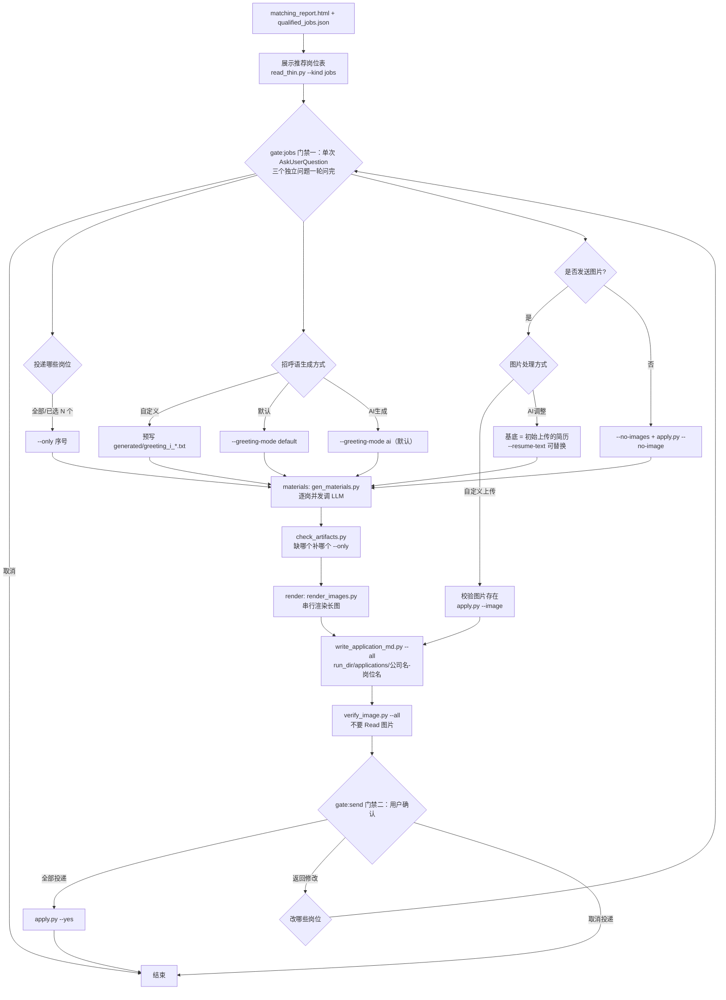

# Auto-Apply Reference

The tail of the pipeline turns confirmed matches into per-job application materials, then applies.
Two user gates bracket the generation phase: **`gate:jobs`** picks the jobs and the material options,
**`gate:send`** approves what was generated. Never apply without passing both.

Four commands, in order:

```bash
python scripts/pipeline.py --run-dir {run_dir} --from materials   # greetings + optimized resumes
python scripts/pipeline.py --run-dir {run_dir} --from render      # resume long-images
python scripts/write_application_md.py "{run_dir}" --all          # per-job archive
python scripts/apply.py "{run_dir}" --yes                         # send (irreversible)
```

`pipeline.py` stops before `apply.py` no matter what flags it is given — applying is the one
irreversible step and it is deliberately outside the pipeline.

## Flow



Two shapes in that diagram are load-bearing:

- **`gate:jobs` is one `AskUserQuestion` call carrying three questions.** Job scope, greeting method,
  and image method are mutually independent — picking `AI生成` does not constrain the image choice,
  and the job set does not change which options are legal. `AskUserQuestion` takes 1–4 questions per
  call, so all three fit in one round trip. They used to be two stops; the 2026-08-14 run spent 30%
  of its wall clock on interaction round-trips, and this merge removes one of them. The follow-ups
  that genuinely *depend* on an answer — validating a `自定义上传` path, offering a different base
  resume for `AI调整` — still come after, because they cannot be asked before the answer exists.
- **`render` is a barrier, `materials` is not.** `gen_materials.py` fans out per job internally with
  no synchronization, but rendering waits for all of them, because one import/export/delete batch
  covers every job. Both scripts run to completion before returning, so the barrier needs no polling
  — `gen_materials.py`'s exit code plus `check_artifacts.py` settles it.

## Display the job table first

```bash
python scripts/read_thin.py {run_dir}/qualified_jobs.json --kind jobs
```

```
📋 Recommended Jobs (N qualified)

| # | Company | Position | Salary | Match | Difficulty | Reason |
|---|---------|----------|--------|-------|------------|--------|
| 1 | XX科技  | Java开发  | 15-25K | 85%   | 易         | 技能高度匹配 |
| 2 | YY公司  | 全栈工程师 | 20-30K | 78%   | 中         | 技术栈匹配 |
```

Include: match strengths, potential gaps, total application count, and priority order. **Never
`Read` `qualified_jobs.json` itself** — it carries full JD text and company descriptions for every
job.

## gate:jobs — One Call, Three Questions

| Question | Options |
|---|---|
| 投递哪些岗位 | `全部合格岗位` / `我来选` (indices via "Other") / `取消` |
| 招呼语生成方式 | `自定义` (user text, shared by all jobs) / `默认` (`generate_greeting()` template) / `AI生成` (one LLM request per job) |
| 是否发送图片 | `自定义上传` (user's image path) / `AI调整` (render an adjusted resume) / `不发送` |

The selected job set drives everything downstream — one directory, one greeting, and (usually) one
adjusted resume per job. Cancelling here ends the run; nothing has been generated yet, so there is
nothing to clean up.

**Do not split this back into separate calls.** If you find yourself wanting to ask the job scope
first "so the next question can mention the count", write the count into the greeting question's
description instead — it is available from the table above.

### Mapping the answers onto flags

| Answer | How it is executed |
|---|---|
| 投递范围 = subset | `--only 1,3,5-7` on both `materials` and `render` (`pipeline.py --only` forwards to both). **Never rewrite `qualified_jobs.json`** — the 1-based index into that file is the alignment key for every artifact name, so editing the file renumbers materials that already exist |
| 招呼语 `自定义` | write the text to `{run_dir}/generated/greeting_{i}_custom.txt` for each selected `i`. `gen_materials.py` skips any job that already has a non-empty `greeting_{i}_` artifact, so the AI mode leaves it alone — no separate flag needed |
| 招呼语 `默认` | `--greeting-mode default` — `generate_greeting()` template, no LLM request |
| 招呼语 `AI生成` | `--greeting-mode ai` (the default) |
| 图片 `自定义上传` | validate the path, `--resume-mode skip`, then `apply.py --image <path>` at send time. `skip` also suppresses `render` (`pipeline.py` emits no render command when the resume is skipped), which is what you want — the generated PNG would never be sent, so generating it would only burn LLM tokens and render time |
| 图片 `AI调整` | default — `materials` writes `resume_{i}_*.json`, `render` turns it into the PNG |
| 图片 `不发送` | `pipeline.py --no-images` (render is skipped entirely) and `apply.py --no-image` |

**`自定义` greeting is one text for every selected job**, supplied via the "Other" field. Per-job
custom text is not offered — that is what `AI生成` plus `gate:send`'s 返回修改 is for. Run
`has_wasted_preview()` on it too and mention it if the first 15 characters are a pleasantry, but
**do not rewrite what the user typed** — offer, don't edit.

**`自定义上传` needs a valid path**, so validate before running `materials`:

- Verify the file exists (`os.path.exists(path)`)
- Accept `.jpg/.jpeg/.png/.gif/.webp/.bmp`
- If the file is missing, ask again — never silently downgrade to "no attachment"
- Copy it into each job directory so the archive is self-contained

**`AI调整` follow-up.** Tell the user the base will be the resume already parsed at `parse`
(`{run_dir}/resume_text.txt`) and let them override it. One extra `AskUserQuestion`:

> 📄 调整简历的内容基底
> - ✅ 用初始上传的简历（`{run_dir}/resume_text.txt`）
> - 📤 重新上传（在 "Other" 里给出文件路径）

An overriding path is passed as `gen_materials.py --resume-text <path>`. Note this replaces only the
*content base* for resume adjustment — `profile.json` and the match scores still come from the
originally parsed resume, so do not re-run matching.

## materials — Per-Job Greeting + Optimized Resume

```bash
python scripts/pipeline.py --run-dir {run_dir} --from materials --only 1,3,5
```

Two LLM requests per job, fanned out at the config's `concurrency`. Products — **the filenames are a
hard contract** that `check_artifacts.py`, `write_application_md.py` and `render_images.py` all align
on:

| Artifact | Content |
|---|---|
| `{run_dir}/generated/greeting_{i}_{company}.txt` | plain-text greeting |
| `{run_dir}/generated/resume_{i}_{company}.json` | the whole `resume_optimize.st` JSON object |

`{i}` is the job's **1-based index in `qualified_jobs.json`**. A failed job leaves a gap rather than
shifting the others, because everything downstream aligns on that number.

Existing non-empty artifacts are **skipped, not overwritten** (`--force` to overwrite). That is what
makes a custom greeting work by pre-writing a file, and what makes topping up cheap.

Long output — one line per job. Run it as a background task and grep the tail.

### Partial failure

Exit code 3 means the artifacts were written but some are missing; exit 1 means the input was
unreadable or everything failed. Check, then top up only the gaps:

```bash
python scripts/check_artifacts.py "{run_dir}"                  # existence + non-empty, one snapshot
python scripts/gen_materials.py "{run_dir}" --only 4           # just the one that failed
```

`check_artifacts.py` takes a snapshot and does not poll — `gen_materials.py` has already returned by
the time you run it, so nothing more can land. It ignores 0-byte files: a truncated write must count
as missing rather than pass the check and send an empty resume onward. `--greeting` / `--resume` /
`--kinds` narrow what it demands.

**One retry, then drop the job from the batch.** Leave it out of `render` and out of the apply list,
and surface it at `gate:send` ("N 个岗位材料生成失败，已跳过"). A job that keeps failing must not hold
up the others.

### Greeting contract

**The prompt lives in `scripts/prompts/greeting.st`** — `gen_materials.py` loads it via
`resume_matcher.prompts.get_greeting_prompt(job, name=…, resume_summary=…, match_reasons=…,
availability=…, scene_hint=…)`. Do not restate its rules anywhere else: the writing guidance used to
be a table right here, which meant two places to edit and one to forget.

Input: the job's row from the match results (company, position, JD, match reasons), plus
`profile.json`. Output: the greeting text only — no commentary.

**The first 15 characters are the whole game.** BOSS Zhipin's message list preview shows only the
first 15 characters (punctuation and brackets included), and that is what an HR scans in a screen of
unread threads to decide whether to open yours. So those 15 characters are a headline, not a
greeting — `您好，我是张三，我对贵司…` spends the entire preview on nothing. The per-scenario formulas
(internship → availability date first; 社招 → years + one hard number; 校招 → cohort + school) are in
the template. `auto_apply.has_wasted_preview(text)` is the cheap check: it returns True when the
preview still starts with a pleasantry, and is worth running on every greeting before `gate:send`,
including one the user typed.

**Three things the model must never invent: 到岗日期, 可实习时长, 每周出勤.** These are commitments
the employer schedules a desk and a start date around — a wrong one is a broken promise, not a
wording problem. They come only from `basic_info.availability`, which `resume_parse.st` fills with
`null` unless the resume states them outright. When absent, the template falls back to a formula that
carries no availability claim. Same rule as always for skills and numbers: only what the resume says.

**Also scenario-dependent: whether to mention 出勤 at all.** For 校招 (signing a 三方 / full-time on
graduation) mentioning "每周3天" reads as "still has classes, unstable" and gets an instant reject —
the template spells out which scenario wants it and which forbids it. `--scene` is a hint, not an
override; the model may correct it from the resume.

### Resume contract

`gen_materials.py` fills `scripts/prompts/resume_optimize.st` — it takes the JD plus the match
analysis and returns `optimized_resume` as Markdown under a no-fabrication rule. The whole JSON
object is saved (not just `optimized_resume`), which is what keeps `optimization_suggestions` /
`key_changes` available for review without a second request.

`optimized_resume` is the renderable document — Markdown, no commentary, and not wrapped in a code
fence. `render` reads that field.

**No personal information in the rendered resume.** The template's 注意事项 #4 (`不需要返回个人信息`)
is deliberate, not an oversight: on BOSS Zhipin the HR already sees the account's name, and the
greeting opens with `我是{name}`, so repeating name / phone / email inside an image that may be
forwarded onward only adds leakage. `optimized_resume` therefore starts at the first content section
(教育背景 / 专业技能 / …) — no name heading, no contact line.

**Heading levels are fixed by the template's 格式要求 block.** `#` is unused on purpose — that level
is the name heading in a normal resume, and this document has no name. `##` is a section (`## 专业技能`),
`###` is one entry inside an experience section (a company, a project, a school) with its date range
appended after `  ||  `. The first line of `optimized_resume` must be a `##`. Do not "fix" a resume
that lacks `#` by adding one; the renderer sizes `##` as the top level.

| gate:jobs answer | Content base (`resume_text` slot) |
|---|---|
| `AI调整` | the original resume text (`{run_dir}/resume_text.txt`, or `--resume-text` override) — keep its section set and ordering, re-weight the wording toward this JD |
| `不发送` | still generated from the same base and still archived; the image simply is not attached at send time, so every job's directory holds the same two files |

**Never fabricate.** The template's own constraint: re-order, re-word, and re-emphasize what the
resume already contains. Do not invent employers, dates, skills, or metrics. A gap that cannot be
filled from the resume must stay visible — `must_add` exists to tell the *user* what to supply, not
to license the model to supply it.

## render — Resume Long-Images

```bash
python scripts/pipeline.py --run-dir {run_dir} --from render --only 1,3,5
# equivalently: python scripts/render_images.py {run_dir} --only 1,3,5
```

One command replaces what used to be five manual steps (start server → stage Markdown → batch import
→ batch export → distribute and rename → delete temp resumes). Skip the stage entirely when the
answer was `自定义上传` or `不发送`.

Exit codes: 0 = every job got an image, 1 = a precondition failed (no resume artifacts, no 姓名,
wrong browser on port 9333), 3 = it ran but some jobs are missing images.

Useful flags: `--only`, `--name 张三` (override `profile.json`), `--url` (reuse a running ShowCV
instead of starting one), `--mode flat|paginated`, `--scale 1|2|3`, `--keep-temp`, `--dry-run`
(stage the Markdown and print the commands, render nothing), `--headless`.

**Serial by design — there is no `--workers`.** Every resume shares one browser, one origin and one
`localStorage`; concurrency only makes them trample each other.

Three protections inside the script, all of which exist because the manual flow got them wrong:

1. **Port 9333 ownership check.** DrissionPage adopts an existing instance on that port and silently
   discards `set_user_data_path` — so an import can land in the user's real resume list and a delete
   can remove their resumes. The script verifies the running browser's `--user-data-dir` is
   `assets/showcv_profile` and refuses otherwise. **Never pass `--adopt-browser` on the user's
   behalf.** See [references/resume-editor.md](references/resume-editor.md) for the full trap.
2. **Staging names carry the run stamp.** `import_md.py` takes each resume's name from the filename
   minus extension, and duplicates become `名字 (2)`, `(3)` … — which silently breaks the name → id
   resolution that export and delete depend on. Staging files are
   `{run_dir}/showcv_staging/<company>-<position>__<stamp>.md`.
3. **The name is never guessed.** `<姓名>-<应聘岗位>.png` is the attachment name the HR sees. When
   `profile.json` has no 姓名 the script exits 1 asking for `--name` rather than using a placeholder.

### The saved filename is `<姓名>-<应聘岗位>`

Both files that represent the resume itself use one base name:

| File | Path |
|---|---|
| Markdown resume | `{run_dir}/applications/<company>-<position>/<姓名>-<应聘岗位>.md` |
| Flat image | `{run_dir}/applications/<company>-<position>/<姓名>-<应聘岗位>.png` |

- **`姓名`** comes from `{run_dir}/profile.json` → `basic_info.name`. Empty or `未提取` → the script
  demands `--name`; ask the user with one `AskUserQuestion` rather than guessing.
- **`应聘岗位`** is that job's position title, no company name. Two postings with the same title
  don't collide because they sit in different `<company>-<position>/` directories.
- `/ \ : * ? " < > |` become `_` in both halves, via `write_application_md.sanitize()` — one
  implementation, so all three files land in the same directory.
- The `.md` is the same Markdown that was staged for ShowCV, copied in rather than regenerated, so
  the image and the Markdown can never disagree.

**Staging names stay unique and stamped; the rename happens on distribution.** `<姓名>-<应聘岗位>` is
*not* unique inside ShowCV's global resume list (姓名 is constant and the stamp is per-run, not
per-job, so two same-title jobs would collide and get silently renamed to `名字 (2)`). Every ShowCV
call resolves by the staged name; the rename to `<姓名>-<应聘岗位>` happens only as files move into
the job directory.

**Never run two ShowCV-driving commands concurrently.** They share one browser, and `import_md.py`,
`storage.py` and `delete_resumes.py` all mutate through the *main* tab — a second command mid-flight
would have zustand `persist` write stale in-memory state back over the result.

### Verify the render without `Read`-ing it

A PNG that exported blank or half-finished must be caught before it is attached to a real
application. Check it with the script, which prints ~8 lines of numbers:

```bash
python scripts/verify_image.py "{run_dir}/applications" --all
```

It flags blank/solid images, too-few content rows, a bottom margin over 25% (export fired before the
page finished laying out), and — by cross-checking the sibling `<姓名>-<应聘岗位>.md` — a render that
contains far less content than its own source. Exit 1 means something is suspicious.

**`Read` on one of these images is the single most expensive thing this skill can do.** Measured on
the 2026-08-13 run (session `3b45c941`), reading `<姓名>-<应聘岗位>.png` — a 509 KB JPEG — cost
**638,960 input tokens in one request**: 79% of that entire 46-minute session's 809k fresh input
tokens. Context went 83k → 722k in one step and immediately tripped auto-compaction, which cost
another 112 s *and* discarded the working context. Images enter context as base64 and bill roughly
per character, so the cost tracks **file size**, not visual complexity — and compaction cannot help,
because it runs after the request that already paid. If a human genuinely needs to look, print the
path and let the user open it.

## Directory Layout & the Per-Job Archive

One directory per job, under the run directory:

```
{run_dir}/
  profile.json
  qualified_jobs.json
  matching_report.html
  generated/                           # materials artifacts — check_artifacts.py checks these
      greeting_1_XX科技.txt
      resume_1_XX科技.json
  showcv_staging/                      # temp Markdown for render, safe to delete
  showcv_exports/                      # raw ShowCV download (png or zip)
  applications/
      XX科技-Java开发/
        岗位信息+招呼语.md
        张三-Java开发.md
        张三-Java开发.png                # 自定义上传 → the user's image, renamed the same way
      YY公司-全栈工程师/
        岗位信息+招呼语.md
        张三-全栈工程师.md
        张三-全栈工程师.png
```

`岗位信息+招呼语.md` holds the job facts and the greeting together, so one file answers "what did I
send to whom". **Generate it with the script — do not hand-write it:**

```bash
# every job in qualified_jobs.json (greetings auto-discovered from generated/)
python scripts/write_application_md.py "{run_dir}" --all

# one job; supply the greeting explicitly for the 自定义 / 默认 branches
python scripts/write_application_md.py "{run_dir}" --index 1 --greeting "您好，我是…"
```

It writes `applications/<company>-<position>/岗位信息+招呼语.md` with **all 25 crawled fields**
grouped into sections — 岗位信息 / 公司信息 (+ 公司介绍全文) / 招聘者 / 岗位要求和职责全文 /
匹配分析 / 招呼语 — plus a 其他采集字段 catch-all so a new CSV column shows up instead of vanishing.
Two fields also get a banner above the tables, because burying them in a table row loses the
decision: `已失效=是` (🚫 applying is wasted — BOSS returned `invalidStatus=true`) and `代招=是` or
`HR公司 ≠ 公司` (⚠️ the contact is a headhunter/outsourcer, not the employer's own HR).

**Why a script instead of writing it by hand.** Twenty-five fields written by hand fail silently — a
missed field is just an absent line, not an error. The 2026-08-13 run produced 11 of them and dropped
商圈/领域/性质/规模/技能标签/福利标签/位置/公司信息/JD/HR×3, and the field set differed per job.

**Why it re-reads the crawl CSV instead of using `qualified_jobs.json`.** `build_job_view()`
(in `resume_matcher/scoring.py`) is the only field mapper, and it **drops `区域` `商圈` `领域` `性质` `位置`
`地址` `已失效` `代招` `HR姓名` `HR公司` entirely** while truncating `公司信息` to 500 and `岗位要求和职责` to 1000 (300/500 on the HTML
path). `领域` (industry) and `性质` (financing stage) are core company facts. So the script resolves
each job's original CSV row by `link` — detail-page fields are written back into that same CSV by the
crawler's detail pass, so its values are complete and untruncated. It falls back to
`job['source_file']`, then to a recursive scan of `assets/post_data/`, and if no row matches it
**warns and exits 1** rather than quietly emitting a thin file.

Empty cells render as `未采集`, never as blank or `否` — `HR在线` empty means *not collected*, not
offline (the field only exists when `-d` fetched `zpData.bossInfo`), and the same trap already
produced a report where collected activity
displayed as 「未采集」 on every card. `已失效` and `代招` share that tri-state via `_tri_state()`.
Match-analysis fields use `未裁定` instead.

## gate:send — Approve

**This gate is not mergeable, not skippable, and not presetable.** Every other stop in the skill has
been merged away or moved into `assets/preferences.json`; this one cannot be, because it is the only
thing standing in front of an irreversible action — a sent greeting cannot be unsent. `preferences.py`
has no field that reaches it, and its whitelist drops any key a user hand-writes into the file trying
to add one (see `references/crawl-commands.md` → 配置预设). It must also see the materials that
actually landed on disk, so it cannot move earlier. Do not treat "the user already said 全部投递 last
run" as an answer for this run.

Notify with the directory paths, then one `AskUserQuestion` covering all jobs at once:

```
✅ 已生成 5 份投递材料，请浏览确认：
  {run_dir}/applications/XX科技-Java开发/
  {run_dir}/applications/YY公司-全栈工程师/
  ...
```

| Answer | Next |
|---|---|
| ✅ 全部投递 | run `apply.py --yes` |
| ✏️ 返回修改 | ask which jobs, then re-ask only the material questions (scope is already settled) → re-run `materials --only <those> --force` and `render --only <those>`. Untouched jobs keep their materials |
| ❌ 取消投递 | stop. The generated directories stay on disk |

Per-job approval is deliberately not offered: the materials are already on disk for inspection, and
a five-question confirmation loop after a five-job generation reads as an interrogation. 返回修改
covers the "most are fine, one is off" case.

## apply — Execute

```bash
python scripts/apply.py "{run_dir}"           # dry run: prints the plan, opens no browser
python scripts/apply.py "{run_dir}" --yes     # sends
```

**Always dry-run first and show that list.** Without `--yes` the script touches no browser at all, so
it is free to run and is the only way to see the resolved order, greeting previews and attachment
paths before anything is sent.

| Flag | Effect |
|---|---|
| `--only 1,3,5` | apply to these 1-based indices only |
| `--company 百度,棱镜数聚` | apply to these companies only (substring match; the dry run lists the available names) |
| `--max N` | cap the batch (slices **after** the activity sort — see below) |
| `--image <path>` | one image for the whole batch (the `自定义上传` answer) |
| `--no-image` | send greetings only (the `不发送` answer) |
| `--name 张三` | override `profile.json`'s 姓名 when resolving attachments |
| `--skip-verify` | skip the `verify_image.py` health check on the attachments (not recommended) |
| `--headless` | no visible browser |

Three precondition checks that **`--yes` does not skip** — only their own explicit flags do:

| Check | Verdict |
|---|---|
| Greeting missing for a selected job | **refuse.** `auto_apply_jobs` would fall back to a built-in generic line, spending one of the day's limited conversations on a pleasantry |
| Attachment missing or failing `verify_image.py` | **refuse** (`--skip-verify` to override). A blank or half-rendered image is worse than no attachment |
| Greeting's first 15 characters are a pleasantry | **warn only.** It is a copy-quality issue and must not block an action the user explicitly asked for |

Exit codes: 0 = dry run completed or everything sent, 1 = a precondition failed (**nothing was
sent**), 3 = sent, but some jobs failed or landed only partially.

It resolves each job's greeting from `generated/greeting_{i}_*.txt` and its attachment from the job
directory's `<姓名>-<应聘岗位>.png`, then logs every result to `{run_dir}/apply_log.json`.

**Apply flow (per job):** open browser with the persistent Chrome profile
(`assets/chrome_user_data/`, port 9222 — distinct from ShowCV's 9333) → visit detail page → click
「立即沟通」 → dismiss popups → click 「继续沟通」 → input greeting → send → (optional) send the
attachment.

`send_resume_attachment()` tries three upload strategies (direct file input → JS injection → button
click fallback) after the greeting is sent. It uploads to **one** file input at a time and verifies
before moving on — pushing the file into every input at once sends duplicates.

### Send verification — never trust a click

Every send is confirmed by **reading the message back out of the chat DOM**. `status: 'applied'`
means a bubble was found; nothing else does.

| Signal | Meaning |
|---|---|
| `_input_greeting()` returns True | text was found *inside the input box* on re-read |
| `_click_send(dp, greeting)` returns True | a `_greeting_probe()` substring was found in the message list |
| `status: 'applied'` + `greeting_verified: True` | greeting bubble confirmed present |
| `status: 'partial'` | text is in the input box but no bubble — **not sent**, user must press Enter |
| `attachment_sent: True` | `img.message-image` count went **up** vs. the pre-send baseline |

Hard-won specifics (2026-08-13, verified against live DOM):

- **Never set `el.innerText` / `el.value` via JS.** BOSS's chat input is a framework-controlled
  component; JS assignment plus synthetic events leaves the internal state empty — the box *looks*
  filled and send dispatches nothing. Use `el.input()` (CDP real input) only.
- **`//button[@type='send']` does not send.** Enter (`dp.actions.type('\n')`) does. Enter is primary,
  the button is a fallback.
- **Image messages are invisible to `innerText`.** Count `img.message-image` elements instead, and
  exclude UI icons (`img.msg-blur`, 24×20) and avatars (72×72).
- A conversation preview reading `您正在与Boss XXX沟通` in the chat list means **zero messages were
  ever sent** in it. `[送达]` plus body text means the greeting landed.

### Apply order: HR activity first

`auto_apply_jobs` sorts before applying, with HR activity as the **primary** key:

```
key = (-hr_activity_sort_key(job), -match_score, company)
```

This is the one place activity outranks `match_score` — an unanswered message to a dormant HR is
worth less than a reply from an active one. Note this is the *opposite* weighting from the report's
tier lists, which keep `match_score` primary (see `references/matching.md` → HR Activity). To flip
it back, swap the first two elements of the tuple; nothing else depends on the order.

Activity is a crawl-time snapshot and is **not** refreshed here — `HR在线` was true when the crawl
ran, not necessarily now. When no job carries activity data (crawled without `-d`), the sort key
collapses to `-1` for every job and the order degrades to pure `match_score`; the run logs
`活跃度未采集，按匹配分排序` instead of `活跃度优先` so this is visible rather than silent.

**Truncation side effect:** `--max` slices *after* this sort, so activity being the primary key
changes *which* jobs get applied to whenever the pool is larger than the cap — not merely the
sequence. A high-activity, lower-score job can displace a top-score job with a dormant HR. Without
`--max` nothing is dropped and the effect never appears.

### Programmatic entry point

`apply.py` is a thin wrapper over one function, for callers that already hold the objects:

```python
from resume_matcher import auto_apply_jobs

results = auto_apply_jobs(
    qualified_jobs=selected_jobs,
    _profile=profile,
    max_applications=len(selected_jobs),
    greetings=greetings,              # keyed by job link
    resume_file_path=resume_images,   # keyed by job link; None when the answer was 不发送
    output_dir=run_dir,
)
```

`resume_file_path` takes either a single path (whole batch shares one attachment) or a
`{job_link: path}` dict (per-job attachment). `apply.py` passes the dict, since each job has its own
`<姓名>-<应聘岗位>.png`.

## Greeting Fallback Chain

| Priority | Source | When |
|----------|--------|------|
| 1 | User-confirmed greeting | `自定义`, or an approved generation |
| 2 | `generate_greeting()` template | `--greeting-mode default`, or an AI generation that returned nothing usable |
| 3 | `_default_greeting()` | Minimal greeting with position name only |

## Safety Rules

- 3-5 second delay between applications
- Max 10-20 applications per session
- Pause and notify user on captcha
- Reuse `assets/chrome_user_data/` login session (port 9222 — distinct from ShowCV's 9333)
- Log every application to `{run_dir}/apply_log.json`
- **Never `Read` a rendered resume image.** See 「Verify the render without `Read`-ing it」— one
  0.5 MB PNG is ~640k input tokens. Use `scripts/verify_image.py`, or hand the path to the user.
- **`--yes` is the only irreversible flag in this skill.** No preset, no earlier answer, and no
  `--all` reaches it.
