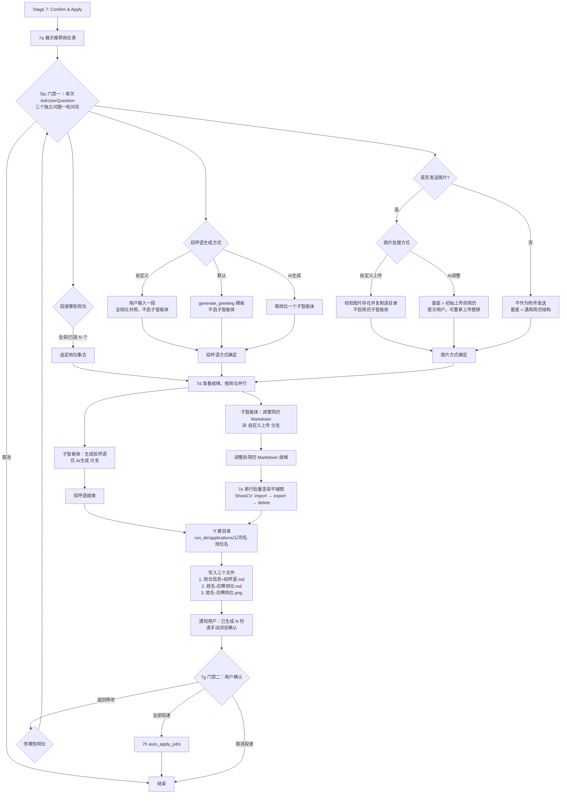

# Auto-Apply Reference

Stage 7 turns confirmed matches into per-job application materials, then applies. Two user gates
bracket the generation phase: **7bc** picks the jobs and the material options, **7g** approves what
was generated. Never apply without passing both.

## Stage 7 Flow



Two shapes in that diagram are load-bearing:

- **7bc is one `AskUserQuestion` call carrying three questions.** Job scope, greeting method, and
  image method are mutually independent — picking `AI生成` does not constrain the image choice, and
  the job set does not change which options are legal. `AskUserQuestion` takes 1–4 questions per
  call, so all three fit in one round trip. They used to be two stops (7b, then 7c with two
  questions); the 2026-08-14 run spent 30% of its wall clock on interaction round-trips, and this
  merge removes one of them. The follow-ups that genuinely *depend* on an answer — validating a
  `自定义上传` path, offering a different base resume for `AI调整` — still come after, because they
  cannot be asked before the answer exists.
- **7e is a barrier, 7d is not.** Resume agents fan out per job with no synchronization, but the
  rendering step waits for all of them, because one import/export/delete batch covers every job.
  **The barrier is settled by checking that the artifact files exist — never by waiting for
  completion notifications.** See 「7d→7e 交接：按产物判定」 below; this distinction has already
  caused one silent stall.

## 7a: Display Recommended Jobs

```
📋 Recommended Jobs (N qualified)

| # | Company | Position | Salary | Match | Difficulty | Reason |
|---|---------|----------|--------|-------|------------|--------|
| 1 | XX科技  | Java开发  | 15-25K | 85%   | 易         | 技能高度匹配 |
| 2 | YY公司  | 全栈工程师 | 20-30K | 78%   | 中         | 技术栈匹配 |
```

Include: match strengths, potential gaps, total application count, and priority order.

## 7bc: Gate 1 — One Call, Three Questions

| Question | Options |
|---|---|
| 投递哪些岗位 | `全部合格岗位` / `我来选` (indices via "Other") / `取消` |
| 招呼语生成方式 | `自定义` (user text, shared by all jobs) / `默认` (`generate_greeting()` template) / `AI生成` (subagent per job) |
| 是否发送图片 | `自定义上传` (user's image path) / `AI调整` (render an adjusted resume) / `不发送` |

The selected job set drives everything downstream — one directory, one greeting, and (usually) one
adjusted resume per job. Cancelling here ends Stage 7; nothing has been generated yet, so there is
nothing to clean up.

**Do not split this back into separate calls.** If you find yourself wanting to ask the job scope
first "so the next question can mention the count", write the count into the greeting question's
description instead — it is available from 7a's table.

**`自定义` greeting is one text for every selected job**, supplied via the "Other" field. Per-job
custom text is not offered — that is what `AI生成` plus 7g's 返回修改 is for. Run
`has_wasted_preview()` on it too and mention it if the first 15 characters are a pleasantry, but
**do not rewrite what the user typed** — offer, don't edit.

**`自定义上传` needs a valid path**, so validate before fanning out in 7d:

- Verify the file exists (`os.path.exists(path)`)
- Accept `.jpg/.jpeg/.png/.gif/.webp/.bmp`
- If the file is missing, ask again — never silently downgrade to "no attachment"
- Copy it into each job directory so the archive is self-contained

**`AI调整` follow-up.** Tell the user the base will be the resume already parsed in Stage 2
(`{run_dir}/resume_text.txt`) and let them override it. One extra `AskUserQuestion`:

> 📄 调整简历的内容基底
> - ✅ 用初始上传的简历（`{run_dir}/resume_text.txt`）
> - 📤 重新上传（在 "Other" 里给出文件路径）

An overriding path goes through `parse_resume_file()` the same way Stage 2 does. Note this replaces
only the *content base* for resume adjustment — `profile.json` and the match scores still come from
the originally parsed resume, so do not re-run matching.

## 7d: Parallel Per-Job Generation

One pair of subagents per confirmed job, all launched in parallel. **Neither subagent touches a
browser** — they return text, and every browser action happens in the main agent (7e, 7h). This is
what makes unrestricted parallelism safe.

**Parallel means every `Agent` call sits in ONE assistant message.** That single mechanic is the only
thing that makes them concurrent — a message carrying one `Agent` call blocks until that agent
returns, so N messages give you N serial agents no matter how many times this file says "parallel".
Cost is then the *sum* of the agents instead of one cold start plus the slowest.

This has already gone wrong once. In the 2026-08-13 run all 4 tasks (2 greetings + 2 resumes) were
dispatched one per message: 318 s wall clock, with `generated/` mtimes landing 46 s / 67 s / 41 s
apart. Parallel would have been ~110-150 s. Note the failure is invisible while it happens — each
agent looks fast on its own, and only the gap between the 7d/7e marks shows the loss.

**Self-check when the barrier settles:** `generated/` mtimes should be *clustered within seconds*.
Staggered by tens of seconds ⇒ the dispatch was serial. Report that as serial dispatch, not as a
"slow" stage — the distinction is the whole difference between a fixable bug and an inherent cost.

Skip rules (from the table in `SKILL.md`): the greeting agent launches only for `AI生成`; the resume
agent launches for `AI调整` and `不发送`, but not for `自定义上传`.

Mark the boundary before dispatching and after the barrier settles, so this stage's real cost is on
disk instead of only in a session transcript:

```bash
python scripts/stage_timer.py mark {run_dir} 7d_dispatch     # before launching agents
python scripts/stage_timer.py mark {run_dir} 7e_start        # after the barrier passes
```

`python scripts/stage_timer.py report {run_dir}` then prints the gap between them. In the
2026-08-13 run this stage was where a duplicate agent dispatch burned ~4 minutes, and the only way
to see it afterwards was parsing a 30 MB JSONL.

### Greeting agent contract

**The prompt lives in `scripts/prompts/greeting.st`** — load it via
`resume_matcher.prompts.get_greeting_prompt(job, name=…, resume_summary=…, match_reasons=…,
availability=…, scene_hint=…)`. Do not restate its rules in the dispatch prompt: the writing
guidance used to be a 5-row table right here, which meant two places to edit and one to forget.

Input: the job's row from the match results (company, position, JD, match reasons), plus
`profile.json`. Output: the greeting text only — no commentary.

**The agent must write its output to `{run_dir}/generated/greeting_{i}_{company}.txt` as well as
returning it** (`{i}` is the job's 1-based index in `qualified_jobs.json`). The file is the artifact;
the return value is only a convenience. See 「7d→7e 交接」 for why.

**The first 15 characters are the whole game.** BOSS Zhipin's message list preview shows only the
first 15 characters (punctuation and brackets included), and that is what an HR scans in a screen of
unread threads to decide whether to open yours. So those 15 characters are a headline, not a
greeting — `您好，我是张三，我对贵司…` spends the entire preview on nothing. The per-scenario formulas
(internship → availability date first; 社招 → years + one hard number; 校招 → cohort + school) are in
the template. `auto_apply.has_wasted_preview(text)` is the cheap check: it returns True when the
preview still starts with a pleasantry, and is worth running on each agent's output before 7f.

**Three things the agent must never invent: 到岗日期, 可实习时长, 每周出勤.** These are commitments
the employer schedules a desk and a start date around — a wrong one is a broken promise, not a
wording problem. They come only from `basic_info.availability`, which `resume_parse.st` fills with
`null` unless the resume states them outright. When absent, the template falls back to a formula that
carries no availability claim. Same rule as always for skills and numbers: only what the resume says.

**Also scenario-dependent: whether to mention 出勤 at all.** For 校招 (signing a 三方 / full-time on
graduation) mentioning "每周3天" reads as "still has classes, unstable" and gets an instant reject —
the template spells out which scenario wants it and which forbids it. `scene_hint` is a hint from the
caller, not an override; the agent may correct it from the resume.

### Resume agent contract

Reuse `scripts/prompts/resume_optimize.st` — it already takes the JD plus the match analysis and
returns `optimized_resume` as Markdown under a no-fabrication rule. The agent fills that template,
and 7e renders the `optimized_resume` field. Its `optimization_suggestions` / `key_changes` fields
are useful review context; keep them in the job directory rather than discarding them.

Output: the template's JSON object. `optimized_resume` inside it is the renderable document —
Markdown, no commentary, and not wrapped in a code fence.

**The agent must write that JSON object to `{run_dir}/generated/resume_{i}_{company}.json` as well as
returning it.** Saving the whole object (not just `optimized_resume`) is what keeps
`optimization_suggestions` / `key_changes` available to 7f without a second agent round.

**No personal information in the rendered resume.** The template's 注意事项 #4 (`不需要返回个人信息`)
is deliberate, not an oversight: on BOSS Zhipin the HR already sees the account's name, and the
greeting opens with `我是{name}`, so repeating name / phone / email inside an image that may be
forwarded onward only adds leakage. `optimized_resume` therefore starts at the first content section
(教育背景 / 专业技能 / …) — no name heading, no contact line. Do not override this in the agent
prompt.

| 7bc answer | Content base (`resume_text` slot) |
|---|---|
| `AI调整` | the original resume text (`{run_dir}/resume_text.txt`, or the user's override) — keep its section set and ordering, re-weight the wording toward this JD |
| `不发送` | a generic resume structure (基本信息 / 教育背景 / 技能 / 项目经历 / 工作经历), populated from `profile.json` |

`不发送` still runs the agent and still renders a PNG — the image just is not attached in 7h. It is
archived so 7g's manual review shows the same two files for every job.

**Never fabricate.** Both bases carry the template's own constraint: re-order, re-word, and
re-emphasize what the resume already contains. Do not invent employers, dates, skills, or metrics.
An agent that cannot find JD-relevant material must leave the gap visible rather than fill it —
`must_add` exists to tell the *user* what to supply, not to license the model to supply it.

## 7d→7e 交接：按产物判定，不按通知判定

Background agents report completion through a notification, and a notification is a *speedup*, not a
correctness guarantee. It can fail to arrive. When it does, the main agent has no other wake signal
— it is only re-invoked by an event, so no event means no turn, and the run sits idle indefinitely
even though every agent already finished. The user sees a hang with no error.

This is not hypothetical. In the 2026-08-13 mock run, all 6 agents launched, the 3 greeting agents
finished *first* (files on disk at 09:54:01/09:54:15), and only the 3 resume agents ever produced a
notification. The main agent announced "等 3 个招呼语 agent" at 09:57:14 and stalled for two minutes
until the user typed 「你还在执行吗」 — at which point a single directory listing showed all 6
artifacts had been present the whole time.

So before starting 7e, settle the barrier against the filesystem. Both 7d contracts require each
agent to write its artifact to `{run_dir}/generated/`, which is what makes this check possible:

```bash
# --wait polls until the artifacts land; default 360s. Raise the Bash timeout to match.
python scripts/check_artifacts.py "{run_dir}" --wait 360
```

**A missing artifact is not proof the agent is dead.** This is the other half of the rule, and
getting it wrong costs as much as the stall did. In the 2026-08-13 real run the resume agent was
dispatched at 11:59:37 and this check was run at 12:00:24 — **47 seconds later**. It reported
「缺失：resume #1」, so a duplicate was dispatched at 12:04:10 and ran for 241 s; meanwhile the
`task_status` record at 12:03:11 shows the *original* agent still `running`. Two agents produced the
same resume, burning ~4 minutes and double the tokens. Resume optimization takes 3–5 minutes, so a
snapshot taken 47 s after dispatch is guaranteed to look empty.

So `--wait` is the default and a bare snapshot (`--wait 0`) is only for re-checking *after* you have
established the agent is no longer running. The script also ignores 0-byte files, since an agent that
has just `open()`ed its output would otherwise pass the barrier and send an empty resume into 7e.

Expect one greeting and one resume per job (minus whatever the 7bc skip rules exempt). Then:

- **All present** → proceed to 7e immediately, regardless of which notifications arrived.
- **Missing after the full wait elapsed** → now you may treat them as dead. Re-dispatch only those.
  Do not re-run agents whose artifact exists; that burns tokens and can overwrite good output with a
  worse sample.
- **Still missing after one re-dispatch** → **drop that job from the batch.** Mark it failed, leave it
  out of the 7e render batch and out of the 7h apply list, and surface it in the 7g summary
  ("N 个岗位材料生成失败，已跳过"). One retry, then move on — a stuck agent must not hold up the
  other jobs' materials.
- **Never re-dispatch on a snapshot alone.** A missing notification, a slow agent, and a dead agent
  are all indistinguishable from the inside; only the elapsed wait separates them.

The same rule applies to any fan-out in this skill: **an agent's artifact on disk is the source of
truth for whether it finished.** Track expected artifacts explicitly rather than counting
notifications.

## 7e: Batch-Render Flat Images (serial)

Runs once, after every resume agent's artifact is confirmed on disk (see above). Skip entirely when
the 7bc answer was `自定义上传`.

```bash
# 1. ensure ShowCV is up — Stage 0 steps 1–2. Reuse a running instance; do not pick a new port
python scripts/showcv/serve.py                  # background; read the SHOWCV_READY line
python scripts/showcv/launch.py <url-from-step-1>

# 2. one import for all jobs (import_md.py batches at 50 automatically)
python scripts/showcv/import_md.py --url <url> {run_dir}/showcv_staging/*.md

# 3. one export, flat mode, addressed by the staged names
python scripts/showcv/export_images.py --url <url> --mode flat \
    --out {run_dir}/showcv_exports --run-dir {run_dir} \
    --name "XX科技-Java开发__20260813-1430" --name "YY公司-全栈工程师__20260813-1430"

# 4. distribute the PNGs into the job dirs (renaming to <姓名>-<应聘岗位>.png), then remove the
#    temp resumes
python scripts/showcv/delete_resumes.py --url <url> --yes \
    --name "XX科技-Java开发__20260813-1430" --name "YY公司-全栈工程师__20260813-1430"
```

**Stage the Markdown under unique filenames first.** `import_md.py` takes each resume's name from
the filename minus extension, and duplicates become `名字 (2)`, `(3)` … — which silently breaks the
name → id resolution that steps 3 and 4 depend on. So write staging copies as
`{run_dir}/showcv_staging/<company>-<position>__<run-stamp>.md`, with the stamp guaranteeing
uniqueness, and replace `/ \ : * ? " < > |` with `_` in company and position for both the filename and
the directory name.

**Read the output naming before hunting for missing files**: one resume in `flat` mode downloads as
`<name>.png`; two or more arrive as `showcv-images-<YYYYMMDD>.zip` containing one `<name>.png` per
resume — i.e. named after the *staged* name, stamp and all. Unzip, then rename on the way into the
job directory (below).

### The saved filename is `<姓名>-<应聘岗位>`

Both files that represent the resume itself use one base name, `<姓名>-<应聘岗位>`:

| File | Path |
|---|---|
| Markdown resume | `{run_dir}/applications/<company>-<position>/<姓名>-<应聘岗位>.md` |
| Flat image | `{run_dir}/applications/<company>-<position>/<姓名>-<应聘岗位>.png` |

- **`姓名`** comes from `{run_dir}/profile.json` → `basic_info.name`. If it is empty or `未提取`,
  ask the user for their name with one `AskUserQuestion` before 7e — this string is what the
  recruiter sees on the attachment, so do not guess it and do not fall back to a placeholder.
- **`应聘岗位`** is that job's position title, no company name. Two postings with the same title
  don't collide because they sit in different `<company>-<position>/` directories.
- Replace `/ \ : * ? " < > |` with `_` in both halves, same as for the directory name (this matches
  `write_application_md.py`'s `sanitize()` — keep them identical so the three files land in one dir).
- The `.md` is the same Markdown that was staged for ShowCV — copy it in, don't regenerate it, so the
  image and the Markdown can never disagree.

**Staging names stay unique and stamped; the rename happens on distribution.** Keep the
`<company>-<position>__<run-stamp>` staging name for import/export/delete — `<姓名>-<应聘岗位>`
is *not* unique inside ShowCV's global resume list (`姓名` is constant and the stamp is per-run, not
per-job, so two same-title jobs would land on one name and get silently renamed to `名字 (2)`,
breaking name → id resolution). So resolve every ShowCV call by the staged name, then rename to
`<姓名>-<应聘岗位>.png` / `.md` only as you move the files into the job directory.

**Confirm which browser you are driving before step 2.** Debug port 9333 is shared with the upstream
`showcv-launch` skill, and an already-running browser is *adopted* with the configured profile
silently discarded — so an import can land in the user's real resume list and a delete can remove
their resumes. Every one of these scripts prints the PID-resolved profile as its first line; read
it. `delete_resumes.py` takes a full backup first and aborts without clicking if the page's list
differs from what it resolved locally. See
[references/resume-editor.md](references/resume-editor.md) for the full trap.

**Never run two of these commands concurrently.** They drive one browser, and `import_md.py`,
`storage.py` and `delete_resumes.py` all mutate through the *main* tab — a second command mid-flight
would have zustand `persist` write stale in-memory state back over the result.

### Verify the render without `Read`-ing it

A PNG that exported blank or half-finished must be caught before 7h attaches it to a real
application. Check it with the script, which prints ~8 lines of numbers:

```bash
python scripts/verify_image.py "{run_dir}/applications" --all
```

It flags blank/solid images, too-few content rows, a bottom margin over 25% (export fired before the
page finished laying out), and — by cross-checking the sibling `<姓名>-<应聘岗位>.md` — a render that
contains far less content than its own source. Exit 1 means something is suspicious.

**`Read` on one of these images is the single most expensive thing this skill can do.** Measured on
the 2026-08-13 run (session `3b45c941`), reading `<姓名>-<应聘岗位>.png` — a 509 KB JPEG — cost
**638,960 input tokens in one request**: 79% of that entire 46-minute session's 809k fresh input
tokens. Context went 83k → 722k in one step and immediately tripped auto-compaction, which cost
another 112 s *and* discarded the 7e/7f working context, so `auto-apply.md` had to be re-read
afterwards. Images enter context as base64 and bill roughly per character, so the cost tracks
**file size**, not visual complexity — and compaction cannot help, because it runs after the request
that already paid. If a human genuinely needs to look, print the path and let the user open it.

## 7f: Directory Layout & Files

One directory per job, under the run directory:

```
{run_dir}/
  profile.json
  qualified_jobs.json
  matching_report.html
  generated/                           # 7d agent artifacts — the 7d→7e barrier checks these
      greeting_1_XX科技.txt
      resume_1_XX科技.json
  showcv_staging/                      # temp Markdown for 7e, safe to delete
  showcv_exports/                      # raw ShowCV download (png or zip)
  applications/
      XX科技-Java开发/
        岗位信息+招呼语.md
        张三-Java开发.md
        张三-Java开发.png                # 自定义上传 → the user's image, renamed the same way
      YY公司-全栈工程师/
        岗位信息+招呼语.md
        张三-全栈工程师.md
        张三-全栈工程师.png
```

`张三-Java开发.md` / `.png` are the resume itself, named `<姓名>-<应聘岗位>` — see the naming rule in
7e. Both live in the job directory, so the same 姓名 and a repeated position title never collide.

`岗位信息+招呼语.md` holds the job facts and the greeting together, so one file answers "what did I
send to whom". **Generate it with the script — do not hand-write it:**

```bash
# every job in qualified_jobs.json (greetings auto-discovered from generated/)
python scripts/write_application_md.py "{run_dir}" --all

# one job; supply the greeting explicitly for the 自定义 / 默认 branches
python scripts/write_application_md.py "{run_dir}" --index 1 --greeting "您好，我是…"
```

It writes `applications/<company>-<position>/岗位信息+招呼语.md` with **all 25 crawled fields**
grouped into sections — 岗位信息 / 公司信息 (+ 公司介绍全文) / 招聘者 / 岗位要求和职责全文 /
匹配分析 / 招呼语 — plus a 其他采集字段 catch-all so a new CSV column shows up instead of vanishing.
Two fields also get a banner above the tables, because burying them in a table row loses the
decision: `已失效=是` (🚫 applying is wasted — BOSS returned `invalidStatus=true`) and `代招=是` or
`HR公司 ≠ 公司` (⚠️ the contact is a headhunter/outsourcer, not the employer's own HR).

**Why a script instead of the agent writing it.** Twenty-five fields written by hand fail silently — a
missed field is just an absent line, not an error. The 2026-08-13 run produced 11 of them and dropped
商圈/领域/性质/规模/技能标签/福利标签/位置/公司信息/JD/HR×3, and the field set differed per job.

**Why it re-reads the crawl CSV instead of using `qualified_jobs.json`.** `build_job_view()`
(`scoring.py:725`) is the only field mapper, and it **drops `区域` `商圈` `领域` `性质` `位置`
`地址` `已失效` `代招` `HR姓名` `HR公司` entirely** while truncating `公司信息` to 500 and `岗位要求和职责` to 1000 (300/500 on the HTML
path). `领域` (industry) and `性质` (financing stage) are core company facts. So the script resolves
each job's original CSV row by `link` — details are written back into that same CSV
(`crawler.py:368-399`), so its values are complete and untruncated. It falls back to
`job['source_file']`, then to a recursive scan of `assets/post_data/`, and if no row matches it
**warns and exits 1** rather than quietly emitting a thin file.

Empty cells render as `未采集`, never as blank or `否` — `HR在线` empty means *not collected*, not
offline (`crawler.py:274`), and the same trap already produced a report where collected activity
displayed as 「未采集」 on every card. `已失效` and `代招` share that tri-state via `_tri_state()`.
Match-analysis fields use `未裁定` instead.

Also keep the adjusted resume's Markdown source in the job directory when the resume agent ran — the
PNG is not editable, and a later 返回修改 should not have to regenerate from scratch.

## 7g: Gate 2 — Approve

**This gate is not mergeable, not skippable, and not presetable.** Every other stop in the skill has
been merged away or moved into `assets/preferences.json`; this one cannot be, because it is the only
thing standing in front of an irreversible action — a sent greeting cannot be unsent. `preferences.py`
has no field that reaches it, and its whitelist drops any key a user hand-writes into the file trying
to add one (see `references/crawl-commands.md` → 配置预设). Do not add a `--yes` flag here, and do not
treat "the user already said 全部投递 last run" as an answer for this run.

Notify with the directory paths, then one `AskUserQuestion` covering all jobs at once:

```
✅ 已生成 5 份投递材料，请浏览确认：
  {run_dir}/applications/XX科技-Java开发/
  {run_dir}/applications/YY公司-全栈工程师/
  ...
```

| Answer | Next |
|---|---|
| ✅ 全部投递 | proceed to 7h |
| ✏️ 返回修改 | ask which jobs, then re-ask only 7bc's material questions (scope is already settled) → 7f for just those. Untouched jobs keep their materials |
| ❌ 取消投递 | stop. The generated directories stay on disk |

Per-job approval is deliberately not offered: the materials are already on disk for inspection, and
a five-question confirmation loop after a five-job generation reads as an interrogation. 返回修改
covers the "most are fine, one is off" case.

## 7h: Execute Apply

```python
from resume_matcher import auto_apply_jobs

results = auto_apply_jobs(
    qualified_jobs=selected_jobs,
    _profile=profile,
    max_applications=len(selected_jobs),
    greetings=greetings,              # keyed by job link
    resume_file_path=resume_images,   # keyed by job link; None when 7bc answered 不发送
    output_dir=run_dir,
)
```

`resume_file_path` takes either a single path (whole batch shares one attachment) or a
`{job_link: path}` dict (per-job attachment) — pass the dict, since each job has its own
`<姓名>-<应聘岗位>.png`. It resolves per the 7bc answer: the user's uploaded image (`自定义上传`, one
path reused for every job), the rendered per-job `<姓名>-<应聘岗位>.png` (`AI调整`), or `None`
(`不发送`).

**Apply flow (per job):**

1. Open browser with the persistent Chrome profile (`./chrome_user_data/`)
2. Iterate over selected jobs
3. For each: visit detail page → click "立即沟通" → dismiss popups → click "继续沟通" → input
   greeting → send → (optional) send resume attachment
4. Log results to `{run_dir}/apply_log.json`

`send_resume_attachment()` tries three upload strategies (direct file input → JS injection → button
click fallback) after the greeting is sent. It uploads to **one** file input at a time and verifies
before moving on — pushing the file into every input at once sends duplicates.

### Send verification — never trust a click

Every send is confirmed by **reading the message back out of the chat DOM**. `status: 'applied'`
means a bubble was found; nothing else does.

| Signal | Meaning |
|---|---|
| `_input_greeting()` returns True | text was found *inside the input box* on re-read |
| `_click_send(dp, greeting)` returns True | a `_greeting_probe()` substring was found in the message list |
| `status: 'applied'` + `greeting_verified: True` | greeting bubble confirmed present |
| `status: 'partial'` | text is in the input box but no bubble — **not sent**, user must press Enter |
| `attachment_sent: True` | `img.message-image` count went **up** vs. the pre-send baseline |

Hard-won specifics (2026-08-13, verified against live DOM):

- **Never set `el.innerText` / `el.value` via JS.** BOSS's chat input is a framework-controlled
  component; JS assignment plus synthetic events leaves the internal state empty — the box *looks*
  filled and send dispatches nothing. Use `el.input()` (CDP real input) only.
- **`//button[@type='send']` does not send.** Enter (`dp.actions.type('\n')`) does. Enter is primary,
  the button is a fallback.
- **Image messages are invisible to `innerText`.** Count `img.message-image` elements instead, and
  exclude UI icons (`img.msg-blur`, 24×20) and avatars (72×72).
- A conversation preview reading `您正在与Boss XXX沟通` in the chat list means **zero messages were
  ever sent** in it. `[送达]` plus body text means the greeting landed.

### Apply order: HR activity first

`auto_apply_jobs` sorts before applying, with HR activity as the **primary** key:

```
key = (-hr_activity_sort_key(job), -match_score, company)
```

This is the one place activity outranks `match_score` — an unanswered message to a dormant HR is
worth less than a reply from an active one. Note this is the *opposite* weighting from the report's
tier lists, which keep `match_score` primary (see `references/matching.md` → HR Activity). To flip
it back, swap the first two elements of the tuple; nothing else depends on the order.

Activity is a crawl-time snapshot and is **not** refreshed here — `HR在线` was true when the crawl
ran, not necessarily now. When no job carries activity data (crawled without `-d`), the sort key
collapses to `-1` for every job and the order degrades to pure `match_score`; the run logs
`活跃度未采集，按匹配分排序` instead of `活跃度优先` so this is visible rather than silent.

**Truncation side effect:** `max_applications` slices *after* this sort, so raising activity to the
primary key changes *which* jobs get applied to whenever `len(qualified_jobs) > max_applications` —
not merely the sequence. A high-activity, lower-score job can now displace a top-score job with a
dormant HR. Stage 7 normally passes `max_applications=len(selected_jobs)`, so nothing is dropped;
the effect only appears when a caller sets a smaller cap.

## Greeting Fallback Chain

| Priority | Source | When |
|----------|--------|------|
| 1 | User-confirmed greeting | 7bc `自定义`, or a 7d/7g-approved generation |
| 2 | `generate_greeting()` template | 7bc `默认`, or an `AI生成` agent that returned nothing usable |
| 3 | `_default_greeting()` | Minimal greeting with position name only |

## Safety Rules

- 3-5 second delay between applications
- Max 10-20 applications per session
- Pause and notify user on captcha
- Reuse `./chrome_user_data/` login session (port 9222 — distinct from ShowCV's 9333)
- Log every application to `{run_dir}/apply_log.json`
- **Never `Read` a rendered resume image.** See 7e「Verify the render without Read-ing it」— one
  0.5 MB PNG is ~640k input tokens. Use `scripts/verify_image.py`, or hand the path to the user.
